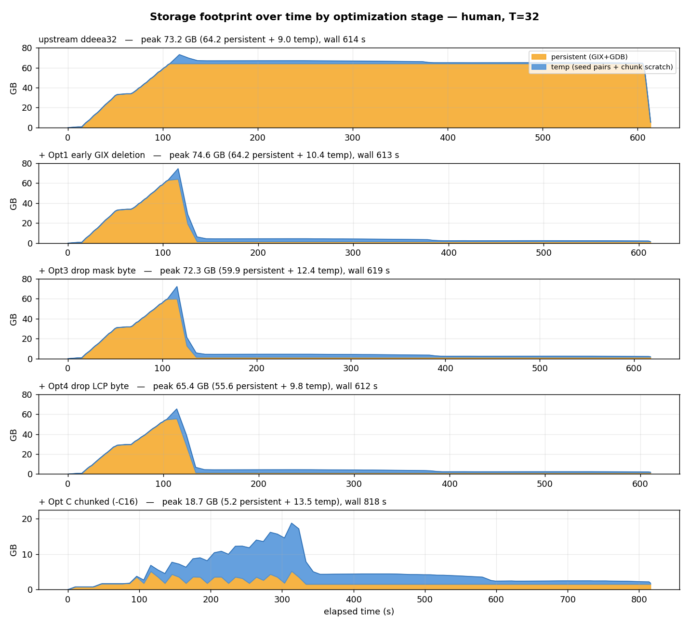
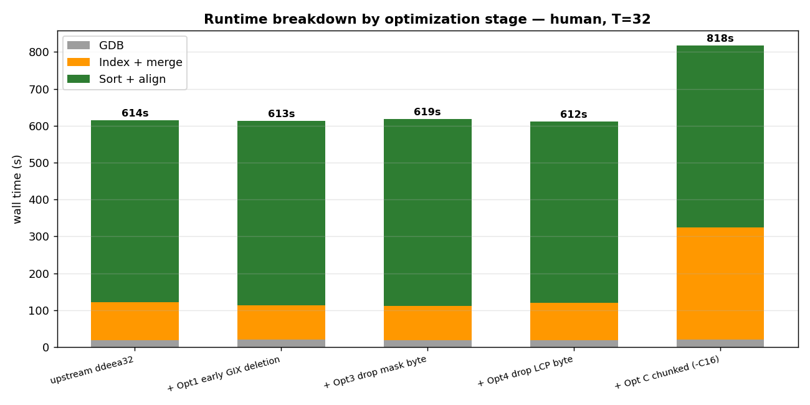

# Incremental optimization profiling — human (GRCh38 × CHM13, T=32)

For **each cumulative optimization stage** on `agent-optimization`, a storage footprint
**over time** and a runtime **breakdown**, on the full human pair at T=32 — the per-stage
detail behind the summary in [`../agent_optimization_report.md`](../agent_optimization_report.md).
Companion to the baseline profiling in [`../../benchmark_baseline/human/`](../../benchmark_baseline/human/).

| Stage | binary | flags |
|---|---|---|
| baseline | upstream `ddeea32` | — |
| + Opt1 | `50e4a16` early GIX deletion | — |
| + Opt3 | `6f90a69` drop mask byte | — |
| + Opt4 | `a946173` drop LCP byte (on-the-fly) | — |
| + Opt C | `1b6014e` bilateral chunked build/merge | `-C16` |

## Results

| Stage | GDB | Index+merge | Sort+align | wall (s) | peak GB (persist + temp) |
|---|--:|--:|--:|--:|--:|
| baseline | 19 | 102 | 493 | 614 | 73.2  (64.2 + 9.0) |
| + Opt1 | 19 | 93 | 500 | 613 | 74.6  (64.2 + 10.4) |
| + Opt3 | 19 | 92 | 507 | 619 | 72.3  (59.9 + 12.4) |
| + Opt4 | 19 | 101 | 492 | 612 | 65.4  (55.6 + 9.8) |
| + Opt C `-C16` | 20 | 305 | 493 | 818 | **18.7**  (5.2 + 13.5) |

*(peaks carry ~few-% run-to-run noise from the temp sampling; the persistent column is exact.)*

### Storage footprint over time



- **Opt1 — the plateau collapses.** The *peak* is unchanged (~73 GB, set during the seed merge
  where both whole GIXs coexist), but the ~64 GB GIX no longer sits idle through sort+align:
  it is freed right after the merge (~130 s), so the long 80%-of-runtime tail drops from 64 GB
  to ~5 GB. This is the win Opt1 exists for — visible only in the *timeline*, not the peak.
- **Opt3 / Opt4 — the persistent block shrinks.** Dropping the mask byte then the LCP byte
  takes persistent peak 64.2 → 59.9 → 55.6 GB (~ −13% cumulative), at no runtime cost.
- **Opt C — a different shape entirely.** Chunked build/merge never materializes a whole GIX;
  the persistent trace is a **sawtooth** (build a chunk, merge, delete, ×16) peaking at only
  **5.2 GB**. But the seed-pair temp accumulates across all 16 chunks and, together with the
  per-chunk GIXmake sort scratch, reaches ~13.5 GB — so the **true peak is 18.7 GB**, not 5 GB.

### Runtime breakdown



- **Opt1/Opt3/Opt4 are runtime-free**: 612–619 s, within noise of the 614 s baseline. `Sort +
  align` (the dominant ~490–500 s, 80% of the run) is **identical** across them — the storage
  optimizations correctly never touch the runtime-critical phase. (Opt4's on-the-fly LCP makes
  the *merge* itself a bit slower, but merge is tiny at human scale.)
- **Opt C trades time for space**: `Index + merge` jumps 102 → 305 s because the GIX is built
  **16×** (once per chunk) instead of once; total wall +204 s (+33%). Sort+align is still
  untouched.

## ⚠️ Caveat: the reported `-C16` "5 GB" is persistent-only

Ashir's report lists `-C16` peak ≈ 5.22 GiB. That matches our **persistent** peak (5.2 GB), but
it appears to omit the seed-pair temp, which is `open()`-then-`unlink()`ed and is invisible to
`du` on a local filesystem (no directory entry; only NFS's silly-rename makes `du` see it).
Counting that temp (via the process's open file descriptors, `st_size`), the **real peak scratch
footprint at `-C16` is ~18.7 GB**. Chunking still cuts peak from ~73 GB to ~18.7 GB (**−74%**),
a large and real win — but not the ~−93% (to ~5 GB) implied by a persistent-only measurement.
The seed temp (~9 GB) is the same external-sort working set present in every mode; chunking
removes the GIX from the peak, not the seeds.

## Reproduce

```bash
# Human FASTA on scratch (edit G1/G2 in run_stages_human.sh if elsewhere).
# The harness builds each stage's binary (checkout + make), installs a working
# 5671357 FAtoGDB (ddeea32's segfaults on CHM13), and runs one monitored T=32
# FastGA per stage capturing storage timeline + FastGA -L breakdown.
bash docs/agent_optimization/human_stages/run_stages_human.sh   # ~1 h (5 human runs)
python3 docs/agent_optimization/human_stages/analyze.py          # -> figures + table
```

`stage_data/<stage>/`: `timeline.tsv` (elapsed, persistent_mb, temp_mb), `run.Llog` (FastGA
`-L`), `run.time` (`/usr/bin/time`). Storage runs on local `/scratch`; temp is summed from
`/proc/PID/fd` (`st_size`) — see [`../../benchmark_baseline/human/README.md`](../../benchmark_baseline/human/README.md).
