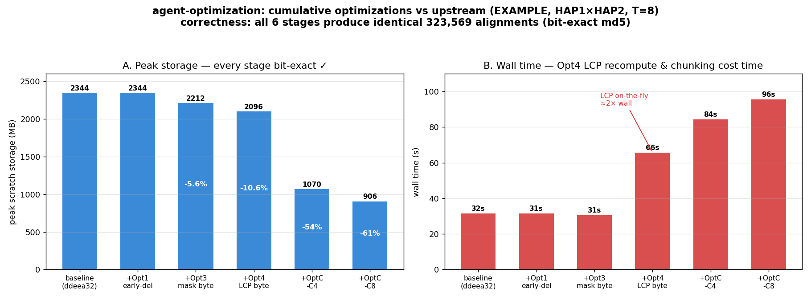
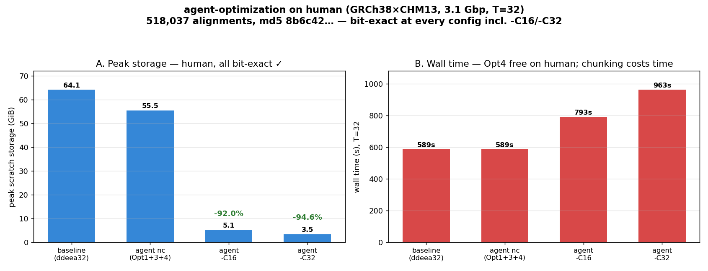

# agent-optimization — Consolidated Storage Optimizations (Verified Report)

**Branch:** `agent-optimization` (built on current upstream `ddeea32`)
**Date:** 2026-07-09
**Dataset:** EXAMPLE (`HAP1.fasta.gz` × `HAP2.fasta.gz`, ~86 Mbp), T=8

This branch consolidates every *effective, verified* FastGA storage optimization onto the
current upstream, applied in order and re-verified at each step. It merges:
- from `optimize-memory`: **Opt1** (early GIX deletion), **Opt3** (drop the mask byte)
- from `agentic-steps` (Ashir Rao, after a correctness fix): **Opt4** (drop the LCP byte,
  recomputed on the fly) and **Opt C** (bilateral chunked GIX build/merge, `-C K`)

> **The chunked optimization (Opt C) only works because of a one-line fix** made in this
> effort — see [§ The fix that made Opt C correct](#the-fix-that-made-opt-c-correct). As
> shipped on `agentic-steps` it crashed (T=1) or silently dropped alignments (T>1).

## Result at a glance



| Stage | Cumulative opts | Correctness | Peak storage | Wall (T=8) |
|---|---|---|---:|---:|
| baseline | upstream `ddeea32` | reference | 2344 MB | 31.5 s |
| +Opt1 | early GIX deletion | **bit-exact** | 2344 MB (0%) | 31.4 s |
| +Opt3 | + drop mask byte | **bit-exact** | 2212 MB (−5.6%) | 30.6 s |
| +Opt4 | + drop LCP byte | **bit-exact** | 2096 MB (−10.6%) | **65.7 s** |
| +Opt C `-C4` | + bilateral chunking | **bit-exact** | 1070 MB (−54%) | 84.4 s |
| +Opt C `-C8` | + bilateral chunking | **bit-exact** | **906 MB (−61%)** | 95.5 s |

**Correctness — the headline:** all six stages produce a **byte-identical** alignment
payload — 323,569 alignments, ONEview payload md5 `e453c60…` — matching the upstream
`ddeea32` baseline at the same thread count. Verified via `ONEview | strip-provenance |
md5sum`. (FastGA's output *byte order* is itself thread-count-dependent in upstream, so
comparisons are always at matched T.)

## Per-optimization analysis

### Opt1 — free the GIX right after the seed merge
Peak is **unchanged** (both GIXs must coexist during the merge, which sets the peak), but
the **sort+align plateau collapses**: sustained scratch during the long tail dropped
2016 → 408 MB (−80%) on EXAMPLE. Zero wall cost, bit-exact. This is the "reduce
time-integrated disk so concurrent jobs don't collide" win; it does not lower a single
job's peak.

### Opt3 — drop the always-zero mask byte
−5.6% peak, no wall cost, bit-exact. The soft-mask byte is dead weight when `-M` is off
(the default). Pure win.

### Opt4 — drop the LCP byte, recompute on the fly ⚠️ time cost
−5.2% additional peak (−10.6% cumulative), bit-exact — **but wall time roughly doubles on
EXAMPLE (31 s → 66 s, +112%, reproducible across repeats).** The LCP byte is removed from
disk and reconstructed per entry during stream reads; on EXAMPLE the seed-merge/read work
is a large fraction of a short run, so the recompute dominates. On human genomes the read
phase is <1% of runtime, so the relative cost is far smaller — **confirmed on human below:
+0.02% wall.** On EXAMPLE, Opt4 is a net loss (−5% disk for +112% time), but on human it is
effectively free; enable it there, skip it on tiny inputs.

### Opt C — bilateral chunked GIX build + merge (`-C K`)
The structural win: instead of holding both whole GIXs on disk at once, build+merge one
prefix-aligned chunk pair at a time (shared `Ksplit` via `-X`, stub-only `-n`). Peak drops
**−54% (`-C4`)** / **−61% (`-C8`)** on EXAMPLE, bit-exact. Cost is wall time (build the GIX
K times): +84 s / +95 s here. On EXAMPLE the peak floor is dominated by the fixed 128 MB
`.gix` stub, so the reduction is smaller than the ~92–95% the report projects for human
genomes (where the ktab, not the stub, dominates). Space-for-time, opt-in via `-C`.

## The fix that made Opt C correct

Opt C on `agentic-steps` was **not** correct as shipped. On EXAMPLE it reproducibly:
- **crashed** at T=1 (`double free or corruption`, SIGABRT), and
- **silently lost 6 alignments** at T=4 and at `-C8` (323,563 vs 323,569),
- happening to be correct only at `-C4 T=8` — the geometry the author tested.

Root cause (ASAN: heap-buffer-overflow WRITE at `FastGA.c:768`, buffer from `FastGA.c:2429`):
in chunked mode the streams are deferred, so `KBYTE` (the merge `cache` stride) is derived
from Post_List fields at `FastGA.c:5149` using `(P2->has_lcp ? 1 : 0)`. Opt4 drops the LCP
byte on disk (`has_lcp==0`), but the **in-memory** k-mer entry always carries a reconstructed
LCP byte, so the real stride (`T2->pbyte`) is 12, not 11. `cache = NTHREADS·(maxp+1)·KBYTE`
was sized at 11 and filled at 12 → overflow. This single off-by-one explains every
symptom: at T=1 the overflow escapes the whole allocation → crash; at T>1 each thread's
slice overflows into the next → corrupted seeds → lost alignments; some geometries never
touch the max-count prefix → lucky-correct.

**Fix (one line):** always `+1` for the in-memory LCP byte —
`kbyte_val = hbyte_val + P2->pbyte + 1 + (P2->has_mask ? 1 : 0);`

Post-fix: crash gone, all configs 323,569 alignments, ASAN clean, and the intentional
`free(S->inver)` leak workaround (~2 GB RAM at K=32 on human) was **re-enabled** — that leak
was the same overflow corrupting the mmap's allocator metadata.

## Recommendation

| Opt | On EXAMPLE | Verdict |
|---|---|---|
| **Opt1** early deletion | −80% sort+align tail, 0 time | **Always on.** Clean win. |
| **Opt3** mask byte | −5.6% peak, 0 time | **Always on.** Clean win. |
| **Opt4** LCP byte | −5% peak, +112% wall (EXAMPLE) / **+0.02% wall (human)** | **On for human** (cost negligible at scale); skip on tiny inputs. |
| **Opt C** chunking | −54…61% (EXAMPLE) / **−92…95% (human)** peak, +time | **Opt-in (`-C`)** for storage-constrained runs. Now correct at all K/T. |

## Human-genome validation (GRCh38 × CHM13, ~3.1 Gbp each, T=32)

> **Per-stage detail:** [`agent_optimization/human_stages/`](agent_optimization/human_stages/)
> profiles each cumulative stage on human (storage footprint over time + runtime breakdown),
> showing Opt1's plateau collapse, Opt3/Opt4's persistent shrink, and Opt C's chunked sawtooth.
> It also documents that the reported `-C16` "5 GB" is persistent-only — the real peak,
> counting the unlinked-open seed temp, is ~18.7 GB (still −74% vs baseline).



Confirmed on the full human pair. All configs **bit-exact** (ONEview payload md5
`8b6c42e63a17…`, **518,037 alignments**) — this md5 and count match Ashir's report exactly,
independently reproducing it.

| Config | Correctness | Peak scratch | Wall |
|---|---|---:|---:|
| baseline (ddeea32) | reference | 64.13 GiB | 589 s |
| agent, non-chunked (Opt1+3+4) | **bit-exact** | 55.52 GiB (−13.4%) | 589 s |
| agent `-C16` | **bit-exact** | **5.13 GiB (−92.0%)** | 793 s |
| agent `-C32` | **bit-exact** | **3.47 GiB (−94.6%)** | 963 s |

Two EXAMPLE-flagged questions, now answered:
1. **Opt4's LCP-recompute cost is negligible on human**: non-chunked wall is 589.2 s vs the
   589.0 s baseline (+0.02%) — the +112% seen on EXAMPLE is small-genome-specific (there the
   short merge/read dominates a short run). On human, read is <1% of runtime.
2. **Opt C peak reduction reaches the headline AND is bit-exact at large K**: −92% / −94.6%
   at `-C16` / `-C32`, T=32 — the exact configs Ashir used and that could not be exercised on
   EXAMPLE (NPARTS=8). The fix generalizes to human scale and large K.

Matches Ashir's report to within measurement noise (his: A+B 55.61 GiB; C16 5.22 GiB/−92.1%;
C32 3.56 GiB/−94.6%; walls 598/800/951 s). Data: `/scratch/jl4257/agent_opt_human2/`.

> **Upstream regression found while running this:** `ddeea32`'s `FAtoGDB` **segfaults**
> building CHM13's GDB (in the "masked sequence → .ano" path); the old-upstream `5671357`
> `FAtoGDB` does not. It is in the 11 ANO commits between them (ironically incl. "Fixed …
> ANO_PAIR.parse"), **unrelated to these storage optimizations**. Workaround here: pre-build
> the GDBs with the working `5671357` `FAtoGDB`, then run FastGA from the `.1gdb` (so only
> GIXmake + merge + align — the optimization path — execute). Worth reporting upstream.

## Caveats / next steps
1. On human, only the one ASAN-identified overflow was chased; ASAN was clean on the fixed
   C4 T=1, the single root cause explains all observed symptoms, and human `-C16/-C32` are now
   bit-exact — but not every (K,T) geometry was exhaustively ASAN-checked.
2. The `ddeea32` FAtoGDB/CHM13 segfault should be reported upstream and fixed independently;
   until then, on-branch human runs need a working FAtoGDB to build GDBs.

## Reproduce
```bash
# stage-by-stage measurement (checkout each boundary commit, build, run, compare)
bash <driver>   # see benchmarks/agent_opt_stages/  and  benchmarks/plot_agent_opt_stages.py
```
Data: `benchmarks/agent_opt_stages/summary.tsv`. Boundary commits: `ddeea32` (baseline),
`50e4a16` (+Opt1), `6f90a69` (+Opt3), `a946173` (+Opt4), `HEAD` (+Opt C).
