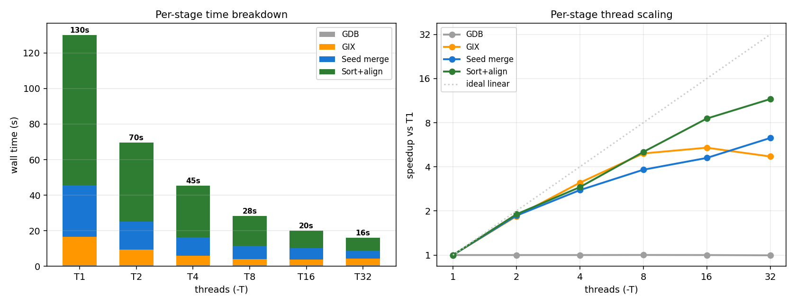

# Performance Profiling — current upstream FastGA (EXAMPLE)

End-to-end performance of **stock upstream FastGA** (`ddeea32`) on the EXAMPLE dataset
(`HAP1.fasta.gz` × `HAP2.fasta.gz`, ~86 Mbp each). Thread scaling is one part of this — the
pipeline runs as **four distinct stages that scale very differently**, so the overall speedup
is a blend of a serial floor and several partially-parallel stages.

Companion to [`storage_profiling.md`](storage_profiling.md). Machine: AMD EPYC 9124,
2×16 cores = 64 logical threads. Threads T = 1…32, median of 3 reps.
All runs produce **323,569 non-redundant alignments** — correctness is invariant to T.

> **32-thread hard cap.** `-T` above 32 is rejected: `GIXmake` exits with
> `# of threads can be at most 32, more doesn't help.` (hard-coded at `GIXmake.c:1819`,
> `if (NTHREADS > 32)`), and since `FastGA` builds the GIX by shelling out to `GIXmake`,
> `FastGA -T64` aborts with "Call to GIXmake failed". It is a deliberate performance cap, not
> a crash — the per-stage data below corroborates the "more doesn't help": GIX build already
> *regresses* past T=16, and every stage is far from linear by T=32.

## The four stages

| Stage | Tool / phase | Threading |
|---|---|---|
| **GDB** | `FAtoGDB` ×2 (FASTA → 2-bit GDB) | **single-threaded** |
| **GIX** | `GIXmake` ×2 (GDB → sorted k-mer index) | multi-threaded (partition + sort) |
| **Seed merge** | FastGA adaptive seed merge over both GIXs | multi-threaded, limited parallelism |
| **Sort+align** | FastGA seed sort + chain + align + output (+PAF) | multi-threaded, dominant |

## Overall scaling


| Threads | Wall (s) | Speedup | Efficiency | CPU% | Peak RSS (MB) |
|--:|--:|--:|--:|--:|--:|
| 1  | 130.6 | 1.00x | 100% | 100 | 513 |
| 2  | 70.0  | 1.87x | 93%  | 185 | 522 |
| 4  | 45.8  | 2.85x | 71%  | 284 | 552 |
| 8  | 28.8  | 4.54x | 57%  | 456 | 653 |
| 16 | 20.3  | 6.43x | 40%  | 662 | 682 |
| 32 | 16.7  | 7.83x | 24%  | 945 | 740 |

Sub-linear, Amdahl-bounded: 7.83× at T=32 (24% efficient). The per-stage breakdown below explains *why* — it is a composite of stages with
very different scaling.

## Per-stage breakdown & scaling



One table per stage — wall time at each T, the T=1→T=32 speedup, and each stage's **share of
the total** at the extremes (median of reps):

| Stage | T=1 | T=2 | T=4 | T=8 | T=16 | T=32 | speedup@32 | share T=1→32 |
|---|--:|--:|--:|--:|--:|--:|--:|--:|
| GDB | 0.9 | 0.9 | 0.9 | 0.9 | 0.9 | 0.9 | 1.00× | 1% → 6% |
| GIX | 15.8 | 8.6 | 5.1 | 3.2 | 2.9 | 3.4 | 4.70× | 12% → 21% |
| Seed merge | 28.9 | 15.6 | 10.4 | 7.6 | 6.3 | 4.6 | 6.29× | 22% → 28% |
| Sort+align | 84.5 | 44.5 | 29.1 | 16.7 | 9.9 | 7.3 | **11.59×** | 65% → 45% |
| **Total (s)** | 130.1 | 69.6 | 45.5 | 28.4 | 20.0 | 16.2 | — | 100% |

**Sort+align dominates** — 65% of the runtime at T=1 — and shrinks most (11.6× at T=32). As the
parallel stages compress, the fixed serial **GDB** floor (~0.9 s) grows from 1% to 6% of total.

Key observations:
- **GDB is a serial floor** — `FAtoGDB` is single-threaded, flat at 1.00× (0.9 s regardless of T).
  It caps the achievable overall speedup (Amdahl).
- **Sort+align scales best** (11.6× at T=32) — the dominant, most-parallel phase, so it drives
  most of the overall gain.
- **Seed merge scales moderately** (6.3× at T=32) — its parallelism is limited by the merge
  structure.
- **GIX regresses past T=16** — 5.40× (T=16) → 4.70× (T=32): on this small dataset GIXmake's
  per-thread overhead outweighs the extra threads. It is a minor contributor by then, so this
  does not hurt the total much, but it is why pushing to T=32 gives diminishing returns.

On the human genome (3.1 Gbp) the parallel sort+align phase dominates even more, so overall
scaling there is materially better than on this small EXAMPLE.

## Reproduce

The baseline is **stock upstream** FastGA. This branch's own `make` bakes in the
optimizations, so build `main` (= upstream `ddeea32` + `.gitignore`) separately:

```bash
# 1. Build a stock-upstream baseline binary in a throwaway worktree
git worktree add /tmp/fastga-baseline main
make -C /tmp/fastga-baseline

# 2. Run the T=1..32 x3 sweep (writes performance_data/results.tsv + logs/*.Llog)
FASTGA=/tmp/fastga-baseline/FastGA \
  bash docs/benchmark_baseline/example/performance_data/run_performance.sh

# 3. Parse -L logs into per-stage tables + the two figures
python3 docs/benchmark_baseline/example/performance_data/analyze.py

# cleanup
git worktree remove /tmp/fastga-baseline
```

`performance_data/`: `run_performance.sh` (driver; `-L` per-stage logs), `results.tsv`
(end-to-end metrics), `logs/T*_rep*.Llog` (per-run stage timing), `analyze.py`
(→ `overall_scaling.png`, `stage_profile.png`).
