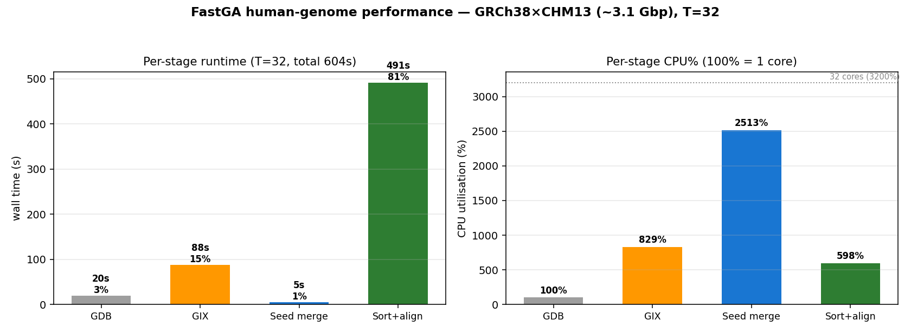

# Human Performance — upstream FastGA (GRCh38 × CHM13, T=32)

Per-stage runtime breakdown and CPU utilisation for **stock upstream FastGA** on the human
pair (~3.1 Gbp each), T=32, median of 3 reps. See [`README.md`](README.md) for setup/method.

| Stage | wall (s) | share | CPU% | threading |
|---|--:|--:|--:|---|
| GDB (`FAtoGDB` ×2) | 19.6 | 3% | 100% | single-threaded |
| GIX (`GIXmake` ×2) | 87.9 | 15% | 829% | multi (~8 cores) |
| Seed merge | 5.5 | 1% | 2513% | multi (~25 cores) |
| Sort + align (+output) | 491.3 | 81% | 598% | multi (~6 cores) |
| **Total** | 604.3 | 100% | — | — |

End-to-end wall (`/usr/bin/time`): **612 s**. Peak RSS: **19.0 GB** — far below the ~64 GB
on-disk GIX, because FastGA streams the sorted index through small (~1.5 MB) buffers rather
than loading it into RAM.

## Key observations

- **Sort + align dominates**: 491 s = **81%** of the run. Everything else (GDB + GIX + seed
  merge) is ~113 s (19%). Any wall-clock optimization must target this phase.
- **CPU% tells the parallelism story** (100% = 1 core; the node has 32):
  - **GDB is serial** — `FAtoGDB` runs at 100% (1 core). A fixed ~20 s floor.
  - **Seed merge is the most parallel** — 2513% (~25 of 32 cores) — but it is only 5.5 s (1%),
    so its excellent scaling barely matters to the total.
  - **Sort + align, the dominant phase, is the *least* parallel of the multi-threaded stages**
    — only 598% (~6 cores) on average. It is bound by sorting/merging and I/O, not compute, so
    it leaves most of the 32 cores idle. This is why overall thread scaling is sub-linear: the
    phase that owns 81% of the time uses ~6 cores.
- This matches the shape on EXAMPLE (sort+align dominant) and Ashir's report (§4:
  FAtoGDB ~20 s, GIXmake ~85 s, seed merge ~6 s, sort+align ~484 s).

## The takeaway for optimization

The storage optimizations (`optimize-memory` / `agent-optimization`) touch only the GIX layout,
when it is freed, and how the seed merge consumes it — i.e. the ~19% of runtime *before*
sort+align. They are correctly designed to leave the dominant 81% (sort+align) untouched, so
they trade storage for a bit of GIX-build time without changing the runtime-critical phase.
