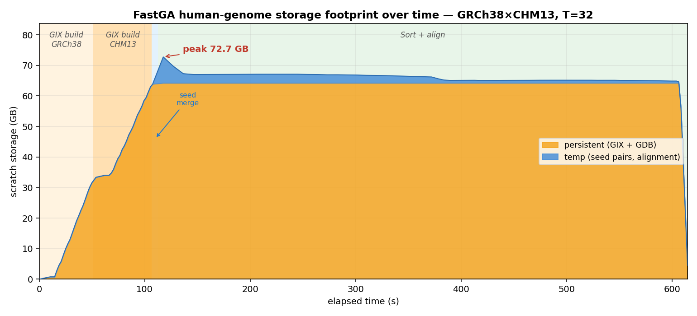

# Human Storage — upstream FastGA (GRCh38 × CHM13, T=32)

Scratch storage footprint over time for **stock upstream FastGA** on the human pair
(~3.1 Gbp each), T=32. See [`README.md`](README.md) for setup and the temp-measurement method.

## Peak

| Component | Size | Note |
|---|--:|---|
| Persistent GIX + GDB | 64.2 GB | both genomes' `.gix`/`.ktab`/`.post` + 2-bit `.bps` |
| Temp (seed pairs, alignment) | 8.5 GB | `_pair.*` etc., `open()`-then-`unlink()`ed |
| **Peak total** | **72.7 GB** | both coexist briefly during the seed merge |

Reproduces Ashir's report (~71 GB peak, ~62.7 GB GIX).

## Shape over time (by phase)

- **GIX build (GRCh38, then CHM13)** — the **persistent** block ramps to ~64 GB over the first
  ~110 s. This is 88% of the peak and it is built up front.
- **Seed merge** (~5 s, a sliver) — **temp** seed-pair files pile up *on top of* both whole
  GIXs, hitting the **peak of 72.7 GB**.
- **Sort + chain + align** (~110 s → ~610 s, 81% of the run) — the temp is consumed and drops
  back, but the **~64 GB GIX plateau stays on disk the whole time** even though this phase
  **never re-reads the GIX**.

That long ~64 GB plateau — GIX sitting idle for 80% of the run — is the central waste this
project's storage work attacks:
- **Opt1 (early GIX deletion)** frees the GIX right after the seed merge, collapsing the
  sort+align plateau (time-integrated disk, the thing that makes concurrent jobs collide).
- **Opt3/Opt4** shrink the per-entry GIX size (mask + LCP bytes).
- **Opt C (chunked build/merge)** never lets both whole GIXs exist at once, cutting the ~64 GB
  *peak* itself (to ~5 GB at `-C16`). See `../../agent_optimization/agent_optimization_report.md`.

## Why the peak is structural

Both genomes' sorted GIXs must be on disk **simultaneously** for the two-pointer seed merge to
run — that requirement sets the ~64 GB peak, and it is the direct cost of FastGA's design
choice (sequential on-disk sort-merge instead of an in-RAM hash table). The temp bump on top is
the external-sort working set for the seeds (too large for RAM). Persistent is du-exact; temp
is summed from open file descriptors (`st_size`) because it is unlinked-while-open — see
[`README.md`](README.md).
