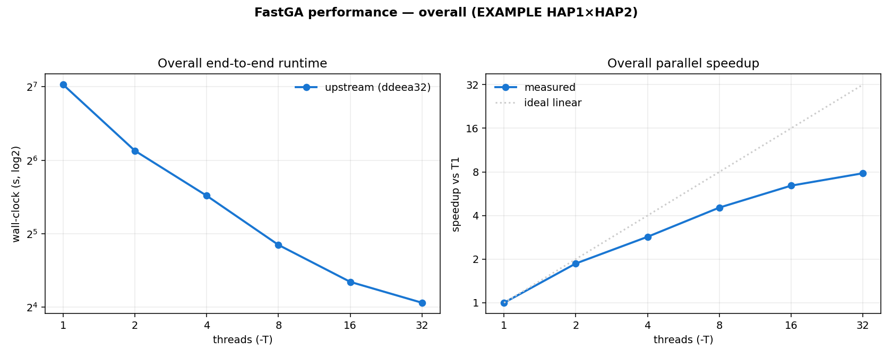
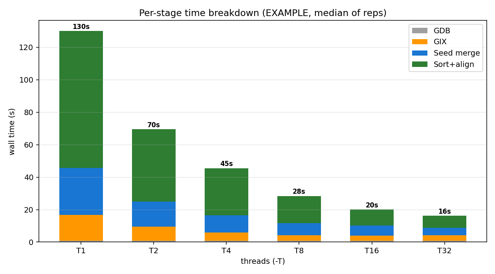
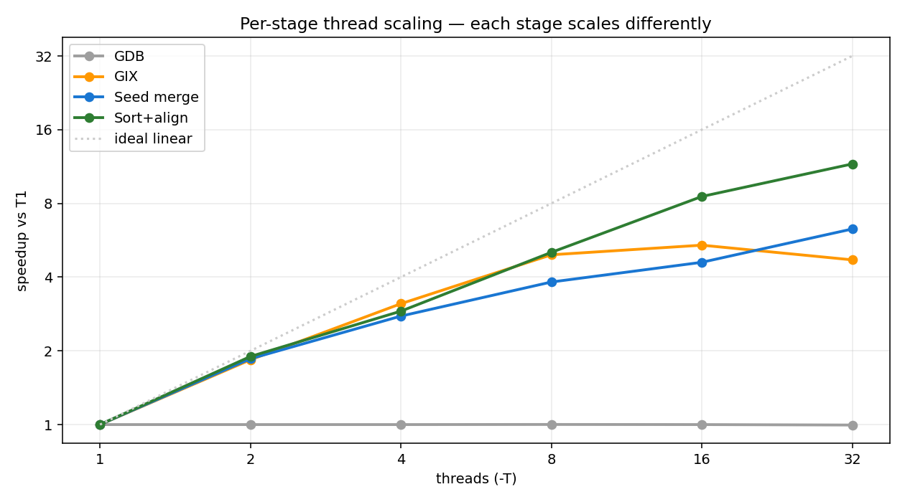

# Performance Profiling — current upstream FastGA (EXAMPLE)

End-to-end performance of **stock upstream FastGA** (`ddeea32`) on the EXAMPLE dataset
(`HAP1.fasta.gz` × `HAP2.fasta.gz`, ~86 Mbp each). Thread scaling is one part of this — the
pipeline runs as **four distinct stages that scale very differently**, so the overall speedup
is a blend of a serial floor and several partially-parallel stages.

Companion to [`storage_profiling.md`](storage_profiling.md). Machine: AMD EPYC 9124,
2×16 cores = 64 logical threads. Threads T = 1…32 (FastGA hard-caps at 32), median of 3 reps.
All runs produce **323,569 non-redundant alignments** — correctness is invariant to T.

## The four stages

| Stage | Tool / phase | Threading |
|---|---|---|
| **GDB** | `FAtoGDB` ×2 (FASTA → 2-bit GDB) | **single-threaded** |
| **GIX** | `GIXmake` ×2 (GDB → sorted k-mer index) | multi-threaded (partition + sort) |
| **Seed merge** | FastGA adaptive seed merge over both GIXs | multi-threaded, limited parallelism |
| **Sort+align** | FastGA seed sort + chain + align + output (+PAF) | multi-threaded, dominant |

## Overall scaling



| Threads | Wall (s) | Speedup | Efficiency | CPU% | Peak RSS (MB) |
|--:|--:|--:|--:|--:|--:|
| 1  | 130.6 | 1.00x | 100% | 100 | 513 |
| 2  | 70.0  | 1.87x | 93%  | 185 | 522 |
| 4  | 45.8  | 2.85x | 71%  | 284 | 552 |
| 8  | 28.8  | 4.54x | 57%  | 456 | 653 |
| 16 | 20.3  | 6.43x | 40%  | 662 | 682 |
| 32 | 16.7  | 7.83x | 24%  | 945 | 740 |

Sub-linear, Amdahl-bounded: 7.83× at T=32 (24% efficient). The next two figures explain
*why* — it is a composite of stages with very different scaling.

## Per-stage time breakdown



Median wall (s) per stage:

| T | GDB | GIX | Seed merge | Sort+align | sum |
|--:|--:|--:|--:|--:|--:|
| 1  | 0.9 | 15.8 | 28.9 | 84.5 | 130.1 |
| 2  | 0.9 | 8.6  | 15.6 | 44.5 | 69.6  |
| 4  | 0.9 | 5.1  | 10.4 | 29.1 | 45.5  |
| 8  | 0.9 | 3.2  | 7.6  | 16.7 | 28.4  |
| 16 | 0.9 | 2.9  | 6.3  | 9.9  | 20.0  |
| 32 | 0.9 | 3.4  | 4.6  | 7.3  | 16.2  |

**Sort+align dominates** — 84.5 s of 130 s (65%) at T=1 — and it is what shrinks most. As the
parallel stages compress, the fixed serial **GDB** floor (~0.9 s) grows in *relative* weight
(0.7% at T=1 → 5.6% at T=32).

## Per-stage thread scaling



Speedup vs T=1 per stage:

| T | GDB | GIX | Seed merge | Sort+align |
|--:|--:|--:|--:|--:|
| 1  | 1.00x | 1.00x | 1.00x | 1.00x |
| 2  | 1.00x | 1.84x | 1.86x | 1.90x |
| 4  | 1.00x | 3.12x | 2.77x | 2.90x |
| 8  | 1.00x | 4.93x | 3.82x | 5.05x |
| 16 | 1.00x | 5.40x | 4.60x | 8.54x |
| 32 | 1.00x | 4.70x | 6.29x | **11.59x** |

Key observations:
- **GDB is a serial floor** — `FAtoGDB` is single-threaded, flat at 1.00× (0.9 s regardless of T).
  It caps the achievable overall speedup (Amdahl).
- **Sort+align scales best** (11.6× at T=32) — the dominant, most-parallel phase, so it drives
  most of the overall gain.
- **Seed merge scales moderately** (6.3× at T=32) — its parallelism is limited by the merge
  structure.
- **GIX regresses past T=16** — 5.40× (T=16) → 4.70× (T=32): on this small dataset GIXmake's
  per-thread overhead outweighs the extra threads. It is a minor contributor by then, so this
  does not hurt the total much, but it is why pushing to T=32 gives diminishing returns.

On the human genome (3.1 Gbp) the parallel sort+align phase dominates even more, so overall
scaling there is materially better than on this small EXAMPLE.

## Reproduce

The baseline is **stock upstream** FastGA. This branch's own `make` bakes in the
optimizations, so build `main` (= upstream `ddeea32` + `.gitignore`) separately:

```bash
# 1. Build a stock-upstream baseline binary in a throwaway worktree
git worktree add /tmp/fastga-baseline main
make -C /tmp/fastga-baseline

# 2. Run the T=1..32 x3 sweep (writes performance_data/results.tsv + logs/*.Llog)
FASTGA=/tmp/fastga-baseline/FastGA \
  bash docs/benchmark_baseline/performance_data/run_performance.sh

# 3. Parse -L logs into per-stage tables + the three figures
python3 docs/benchmark_baseline/performance_data/analyze.py

# cleanup
git worktree remove /tmp/fastga-baseline
```

`performance_data/`: `run_performance.sh` (driver; `-L` per-stage logs), `results.tsv`
(end-to-end metrics), `logs/T*_rep*.Llog` (per-run stage timing), `analyze.py`
(→ `overall_scaling.png`, `stage_breakdown.png`, `stage_scaling.png`).
