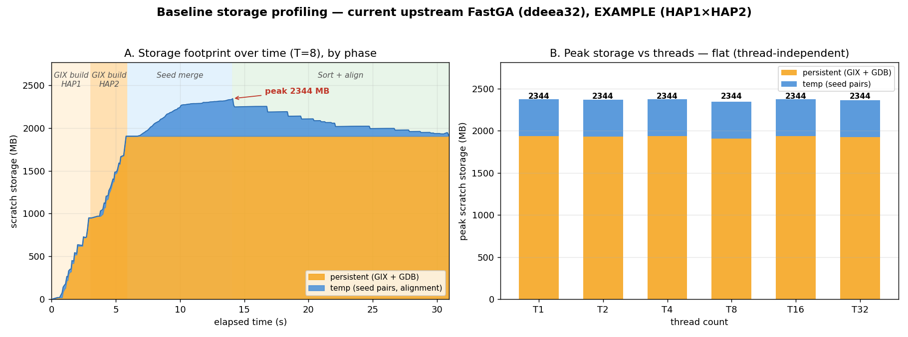

# Baseline Storage Profiling — current upstream FastGA (EXAMPLE)

Storage footprint of **stock upstream FastGA** (`ddeea32`) on the EXAMPLE dataset
(`HAP1.fasta.gz` × `HAP2.fasta.gz`, ~86 Mbp each), default (no-mask) run.
Companion to [`performance_profiling.md`](performance_profiling.md).



## Peak storage

| Component | Size | Note |
|---|---:|---|
| Persistent GIX + GDB | 1905.3 MB | the `.gix`/`.ktab`/`.post` index + 2-bit `.bps` |
| Temp (seed-pair files) | 438.4 MB | `_pair.*`/`_uniq.*`/`_algn.*`, unlinked-but-open |
| **Peak total** | **2343.7 MB** | both coexist during the seed merge |

**Thread-independent:** peak is identical (2343.7 MB) from T=1 to T=32 — file sizes are set by
genome content + parameters (K=40, `-f`), not by parallelism. More threads only compress the
timeline in wall-clock; they do not change the peak (Panel B).

## Where the storage goes (Panel A, T=8)

The stacked timeline (persistent orange + temp blue = total) traces the pipeline by phase
(regions labelled from the same run's `-L` log):
- **GIX build (HAP1, then HAP2)** — the **persistent** block ramps up to ~1.9 GB as the two
  GIX indices are written; temp is minimal here (GIXmake sort scratch).
- **Seed merge** — **temp** seed-pair files accumulate *on top of* both whole GIXs, reaching
  the **peak of ~2344 MB** (1905 persistent + 438 temp).
- **Sort + chain + align** — temp is consumed and steps back down.

In stock upstream the GIX is **not** freed after the seed merge — the ~1.9 GB persistent block
stays on disk through the long sort+align tail, even though that phase never re-reads it. (That
plateau is exactly what the `optimize-memory` Opt1 "early GIX deletion" targets.)

## Method

FastGA run with `-k` (keep GIX) and `-P <tmpdir>`, while a background monitor polls `du -sb` on
**both** the workdir (persistent GDB/GIX) and the tmpdir (temp) every 50 ms — capturing the
combined footprint over time. The temp files are `open()`-then-`unlink()`ed, so they are
invisible to `ls`; `du` still counts their blocks **only on a filesystem that keeps a directory
entry for deleted-but-open files** — NFS does (silly-rename `.nfsXXXX`), local ext4/xfs and
tmpfs do **not**. The audit therefore runs its scratch on the repo's NFS mount by default.
Threads swept T = 1…32. All scripts + data live under [`storage_data/`](storage_data/).

## Reproduce

The baseline is **stock upstream** FastGA. This branch's own `make` bakes in the
optimizations, so build `main` (= upstream `ddeea32` + `.gitignore`) separately:

```bash
# 1. Build a stock-upstream baseline binary in a throwaway worktree
git worktree add /tmp/fastga-baseline main
make -C /tmp/fastga-baseline

# 2. Run the storage audit against it (writes storage_data/audit/)
FASTGA=/tmp/fastga-baseline/FastGA \
  bash docs/benchmark_baseline/storage_data/run_storage_audit.sh

# 3. Regenerate this figure from storage_data/audit/
python3 docs/benchmark_baseline/storage_data/plot.py

# cleanup
git worktree remove /tmp/fastga-baseline
```

`storage_data/`: `run_storage_audit.sh` (driver), `monitor_storage.sh` (polls work+tmp `du`),
`audit/` (committed `summary.csv`, per-thread `T*_timeline.tsv` and `T*.Llog` phase logs),
`plot.py` (→ `storage_profiling.png`). Scratch defaults to the repo's NFS mount; override with
`BENCH_SCRATCH=<nfs-dir>` (must not be local ext4/xfs or tmpfs — see Method).

> Old upstream (`5671357`) was verified byte-identical to `ddeea32` on this profile (the 11
> intervening commits touch only ANO/mask and read paths, not the write path), so these numbers
> are representative of upstream generally. That old-vs-new comparison is archived under
> [`../old_archive/`](../old_archive/).
