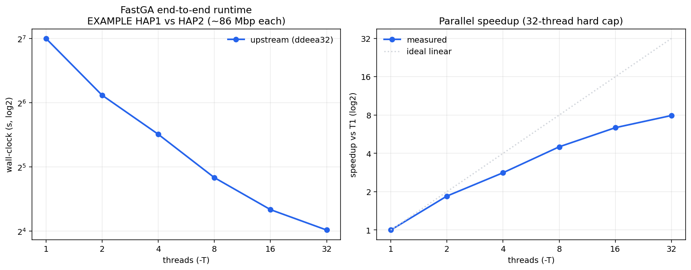

# FastGA Thread Scaling — New Upstream Build (2026-07-09)

Thread scaling study of the **current upstream FastGA** (`ddeea32`) on the repo EXAMPLE
dataset — end-to-end build+align wall clock, CPU, and peak RSS vs thread count (T=1…32).

> **Companion:** [`storage_profiling.md`](storage_profiling.md) — the disk-storage profile
> for the same build.

## Build Under Test

| Item | Value |
|---|---|
| Branch / commit | `main` @ `10ebff7` = upstream `ddeea32` ("Fixed a bug for the uninitialised field ANO_PAIR.parse") + local `.gitignore` |
| Source | `thegenemyers/FASTGA` upstream/main, freshly `make clean && make` |
| Note | This is the **stock upstream** aligner — it does NOT contain the `optimize-memory` Opt1/Opt3 storage changes. |

## Test Configuration

| Parameter | Value |
|---|---|
| Dataset | EXAMPLE/HAP1.fasta.gz vs EXAMPLE/HAP2.fasta.gz (~86 Mbp each) |
| Server | en-ec-zhang-x4 (same machine as the 2026-03-21 study) |
| CPU | AMD EPYC 9124 16-Core (2 sockets x 16 cores = 64 logical threads) |
| Thread counts tested | 1, 2, 4, 8, 16, 32 (and 64, which fails — see below) |
| Repeats per config | 3 (median reported) |
| Date | 2026-07-09 |
| Measurement | `/usr/bin/time -v` for wall/CPU/RSS; FastGA `-L:` log for phases |
| Command | `FastGA -v -T<N> -P. -L:<log> HAP1.fasta.gz HAP2.fasta.gz > out.paf` |
| Method | Generated GDB/GIX/index files removed before every run, so each measurement is a full end-to-end build+align. |

**T=64 fails**: `GIXmake: # of threads can be at most 32, more doesn't help.`
FastGA hard-caps threads at 32. Results cover T=1..32.

## Overall Thread Scaling (median of 3 repeats)

| Threads | Wall (s) | User (s) | Sys (s) | CPU% | Peak RSS (MB) | Speedup | Efficiency | Non-redundant aln |
|--------:|---------:|---------:|--------:|-----:|--------------:|--------:|-----------:|------------------:|
| 1  | 128.4 | 101.4 | 27.2 | 100% | 513 | 1.00x | 100.0% | 323,569 |
| 2  | 69.5  | 101.2 | 28.0 | 185% | 523 | 1.85x | 92.5%  | 323,569 |
| 4  | 45.6  | 101.8 | 27.9 | 284% | 552 | 2.82x | 70.4%  | 323,569 |
| 8  | 28.5  | 102.6 | 27.8 | 457% | 653 | 4.50x | 56.3%  | 323,569 |
| 16 | 20.2  | 105.4 | 28.2 | 662% | 682 | 6.37x | 39.8%  | 323,569 |
| 32 | 16.2  | 122.5 | 31.1 | 946% | 740 | 7.94x | 24.8%  | 323,569 |



*Left: end-to-end wall clock (log-log). Right: speedup vs T=1 against ideal
linear; the 32-thread hard cap bounds the x-axis.*

## Key Observations

**Correctness invariant to thread count.** All runs at every thread count
produced exactly **323,569 non-redundant alignments** (ave len 1953 bp). Thread
count does not change results — a good multi-threading correctness check.

**Sub-linear scaling, Amdahl-bounded.** Near-linear through T=4 (2.82x, 70%
efficient), then diminishing: T=32 reaches 7.94x (25% efficient). At T=32 the
average CPU utilisation is only ~946% (~9.5 of 32 cores busy on average),
because serial-heavy phases dominate on this small dataset:
- `FAtoGDB` (GDB creation) is single-threaded (~0.4s x 2 genomes).
- `ALNtoPAF` (PAF conversion) is single-threaded.
- The seed-merge phase has limited parallelism.

On the human genome (3.1 Gbp) the parallel alignment phase dominates, so
scaling there is materially better (see the human T=32 section of
`../old_archive/benchmark_performance.md`).

**Memory grows modestly.** Peak RSS 513 MB (T=1) → 740 MB (T=32), 1.44x for 32x
threads — per-thread buffers are small relative to shared structures.

## Reproduce

The baseline is **stock upstream** FastGA. This branch's own `make` bakes in the
optimizations, so build `main` (= upstream `ddeea32` + `.gitignore`) separately:

```bash
# 1. Build a stock-upstream baseline binary in a throwaway worktree
git worktree add /tmp/fastga-baseline main
make -C /tmp/fastga-baseline

# 2. Run the T=1…32 x3 sweep against it (writes thread_scaling_data/results.tsv)
FASTGA=/tmp/fastga-baseline/FastGA \
  bash docs/benchmark_baseline/thread_scaling_data/run_thread_scaling.sh

# 3. Rebuild the median table + this figure from results.tsv
python3 docs/benchmark_baseline/thread_scaling_data/analyze.py

# cleanup
git worktree remove /tmp/fastga-baseline
```

`thread_scaling_data/`: `run_thread_scaling.sh` (driver; override `THREADS`/`REPS` via env),
`results.tsv` (committed per-run metrics), `analyze.py` (→ median table + `thread_scaling.png`).
