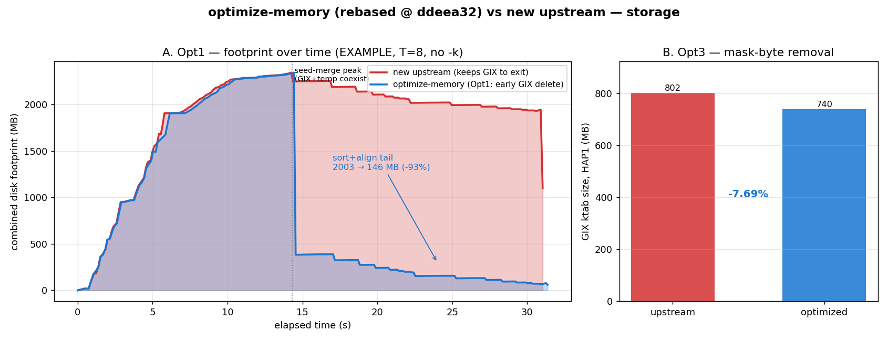

# optimize-memory (rebased onto new upstream) vs new upstream

Quantifies the `optimize-memory` storage optimizations (Opt1 + Opt3) **on the current
upstream** (`ddeea32`), after rebasing the branch off the old baseline (`5671357`).
Companion to [`benchmark_storage_upstream.md`](benchmark_storage_upstream.md).

## Setup

- Branch `optimize-memory-ddeea32` = `optimize-memory` (18 commits) **rebased onto `ddeea32`**.
  Rebase was **conflict-free** — Opt1/Opt3 hunks don't overlap upstream's ANO edits.
- Both binaries built from clean worktrees; EXAMPLE dataset (HAP1 vs HAP2), T=8.
- Active optimizations after rebase: **Opt1** (early GIX deletion) + **Opt3** (mask-byte
  removal). Opt5 (ktab compression) was reverted upstream of this branch and is not present.

## Correctness — bit-exact ✅

```
FastGA -T8 -1:out.1aln HAP1 HAP2   (upstream vs optimized)
ONEview out.1aln | tail -n +8      -> 1,449,232 lines each, diff empty
```

Alignment output is **byte-identical** to upstream. The rebase did not perturb results.



## Opt3 — mask-byte removal: **−7.69% GIX**

Building HAP1's GIX with each `GIXmake` (default, no `-M`):

| | ktab size (HAP1) |
|---|---:|
| upstream | 840,595,878 B (802 MB) |
| optimized | 775,934,664 B (740 MB) |
| **reduction** | **64,661,214 B (−7.69%)** |

> Note: an earlier check using the **stale** repo-root binary showed *no* reduction — that
> binary predated the branch's Opt3 code. The freshly rebased+built binary reproduces the
> documented −7.7%. Always rebuild before measuring.

## Opt1 — early GIX deletion: sort+align tail **−93%**

Run **without `-k`**, monitoring combined footprint (persistent GIX/GDB + temp) over time:

| metric (T=8) | upstream | optimized |
|---|---:|---:|
| **peak** total | 2343.7 MB | 2343.7 MB |
| sort+align tail (mean, last 40%) | **2003 MB** | **146 MB** |
| footprint near exit | 1102 MB | 60 MB |

**The peak is unchanged** — it occurs during seed merge, where both genomes' GIX and the
ramping temp files coexist, and Opt1 only deletes GIX *after* seed merge. What Opt1 collapses
is the **long sort+align tail**: 2003 → 146 MB (**−93%**, ~1.86 GB freed on EXAMPLE).

### Why the tail matters more than the peak

Sort+align is the dominant phase (≈82% of wall-clock on human genomes per the archived
benchmarks). During it, upstream needlessly holds the entire GIX (~63 GB for human) even
though that phase only reads `.bps` and the seed-pair temps. Freeing GIX early is what makes
**concurrent FastGA runs** on one node viable — each run's disk drops to the temp+bps working
set for the bulk of its runtime, instead of pinning tens of GB the whole time.

## Bottom line

| optimization | effect on EXAMPLE | notes |
|---|---|---|
| Opt3 (mask byte) | GIX **−7.69%** | shrinks peak *and* sustained persistent size; always on (no `-M` needed) |
| Opt1 (early GIX delete) | sort+align footprint **−93%** | peak unchanged; enables concurrency; needs a real run (`-k` suppresses it) |
| correctness | **bit-exact** | 1.45M alignment records identical |

Both optimizations rebase cleanly onto `ddeea32` and remain correct + effective on the
current upstream. Extrapolated to human genomes, Opt1 turns the ~63 GB GIX from a
whole-run resident into a seed-merge-only cost.

## Reproduce

```bash
# Opt3 ktab size + Opt1 timeline (both use the two worktree builds)
python3 benchmarks/plot_optmem_vs_upstream.py   # regenerate figure from opt1_timeline/*.tsv
```

Raw data: `benchmarks/opt1_timeline/{upstream,optimized}_timeline.tsv`.
Rebased branch: `optimize-memory-ddeea32` (local only — **not pushed**).
