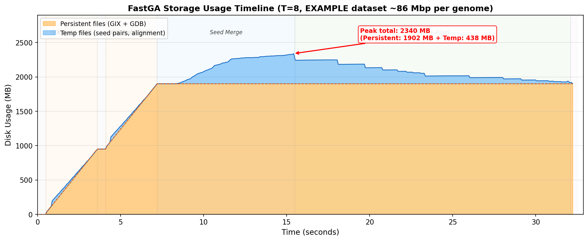
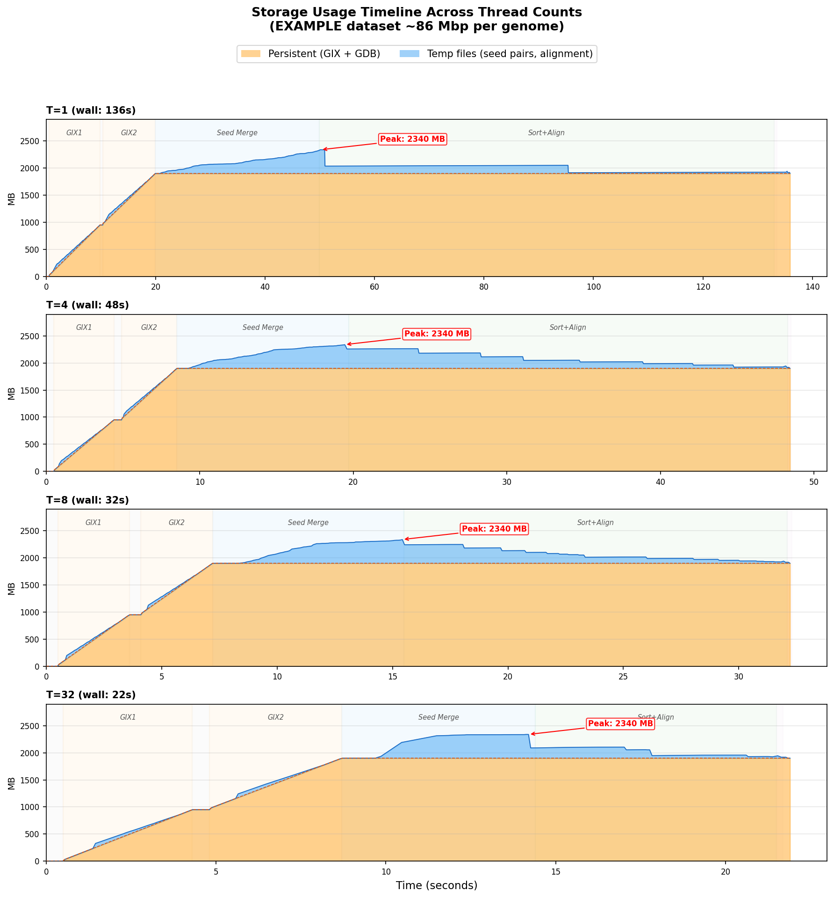

# FastGA Benchmark: Storage & Intermediate File Analysis

## Test Configuration

| Parameter | Value |
|---|---|
| Dataset | EXAMPLE/HAP1.fasta.gz vs EXAMPLE/HAP2.fasta.gz (~86 Mbp each) |
| Server | en-ec-zhang-x4 |
| CPU | AMD EPYC 9124 16-Core Processor (2 sockets x 16 cores = 64 threads) |
| Thread counts tested | 1, 2, 4, 8, 16, 32 |
| Date | 2026-03-21 |
| Measurement tools | `du -sb` on dedicated tmpdir (0.05s interval), `ls -la` for persistent files |

## File Inventory: What Each Phase Creates

### Phase 1: GDB Creation (`FAtoGDB`)

**Input**: FASTA file (`.fa` / `.fa.gz`)
**Output (persistent)**:

| File | Description | HAP1 Size | HAP2 Size | Scaling |
|---|---|---:|---:|---|
| `<genome>.1gdb` | ONEcode metadata (scaffold/contig info) | 1.3 KB | 1.3 KB | Scales with # contigs, tiny |
| `.<genome>.bps` | 2-bit compressed DNA sequences | 20.6 MB | 20.7 MB | ~genome_size / 4 bytes |
| `<genome>.1ano` | Soft mask intervals (if detected) | 2.5 KB | 2.5 KB | Scales with # masked regions |

**Intermediate files**: None. **Total per genome**: ~20.6 MB.

### Phase 2: GIX Build (`GIXmake`)

**Input**: `.1gdb` + `.bps`
**Output (persistent)**:

| File | Description | HAP1 Size | HAP2 Size | Scaling |
|---|---|---:|---:|---|
| `<genome>.gix` | Prefix index stub (16M int64 entries) | **128.0 MB** | **128.0 MB** | **Always 128 MB** (fixed) |
| `.<genome>.ktab.1` through `.ktab.8` | Sorted k-mer table partitions (k-mer suffix + LCP + count + position) | **801.6 MB** total | **806.4 MB** total | ~9.3 GB per Gbp |
| **GIX total** | | **929.7 MB** | **934.4 MB** | **~10.8 GB per Gbp** |

Each `.ktab` partition stores sorted k-mer entries at ~13-15 bytes per k-mer. With syncmer filtering sampling ~75% of positions and indexing both strands, the total k-mer count is ~1.5 * genome_size * 0.75. The `.gix` stub is always exactly 128 MB regardless of genome size.

**Intermediate files (temp, immediately unlinked)**:

| File | Description | Count | Size Estimate |
|---|---|---|---|
| `._post.<pid>.<k>.idx` | Distribution files for syncmer positions, delta-encoded (1-4 bytes per entry) | NTHREADS x NPARTS | Total ~genome_size bytes, spread across files |

**Measured peak**: ~62 MB in tmpdir during GIXmake.

### Phase 3: Seed Merge (inside `FastGA.c`)

**Input (read)**: Both genomes' `.gix`, `.ktab.*`, `.bps` files — all held open simultaneously.

**Measured peak open FDs during this phase** (T=8): **~2.0 GB** — consisting of:
- 2 x `.gix` files: 2 x 128 MB = 256 MB
- 2 x 8 `.ktab.*` files: ~1,607 MB
- 2 x `.bps` files: ~42 MB
- **Total read-open**: ~1,905 MB

**Output (temp, immediately unlinked)**:

| File | Description | Count | Record Width | Estimated Size |
|---|---|---|---|---|
| `_pair.<pid>.<k>.N` | Normal-strand seed pairs | NPARTS x NTHREADS | 1 + IBYTE + JBYTE bytes per seed (~10 bytes) | **~438 MB total (measured)** |
| `_pair.<pid>.<k>.C` | Complement-strand seed pairs | NPARTS x NTHREADS | same | (included in above) |

Each seed pair stores: 1 byte LCP + IBYTE (position+contig in genome1, typically 4-5 bytes) + JBYTE (position+contig in genome2, typically 4-5 bytes). For the EXAMPLE dataset: 51M seeds x ~9 bytes ≈ 438 MB (measured via `du -sb` on dedicated tmpdir).

### Phase 4: Seed Sort + Alignment (inside `FastGA.c`)

**Input (read)**: `_pair.*` temp files (from Phase 3) + `.bps` files (for alignment). GIX/ktab files are **closed and no longer needed** — `Free_Kmer_Stream()` is called at the end of seed merge.

**Output (temp, immediately unlinked)**:

| File | Description | Count | Record Width | Estimated Size |
|---|---|---|---|---|
| `_algn.<pid>.<tid>.las` | Raw alignment records (before dedup) | NTHREADS | 40 bytes (Overlap) + ~2*ceil(L/100) bytes trace per alignment | Temporary, overwritten by _uniq |
| `_uniq.<pid>.<tid>.las` | Deduplicated alignments | NTHREADS | 32 bytes (Overlap minus pointer) + ~2*ceil(L/100) bytes trace | **~27 MB total** |

For the EXAMPLE dataset: 376K alignments x avg 1953bp length → trace = ~40 bytes/aln → 72 bytes/aln total → ~27 MB.

**Output (persistent)**: `.1aln` file — 19.5 MB (ONEcode compressed trace-point encoding, ~15-16x smaller than equivalent PAF with CIGAR).

### Phase 5: PAF Conversion (`ALNtoPAF`)

**Input**: `.1aln` + `.1gdb` + `.bps`
**Output**: PAF text to stdout (no persistent file unless redirected)
**Intermediate files**: None.

## Storage Usage Timeline



The figure above shows disk usage over time for T=8. The orange area is persistent files (GIX + GDB) that accumulate during the GIX build phases. The blue area is temp files (seed pairs, alignment records) that peak during seed merge and drain during sort+align. The peak total is ~2,340 MB, occurring at the transition from seed merge to sort+align.



The comparison across T=1, 4, 8, 32 shows that **peak storage is identical (~2,340 MB) regardless of thread count** — only the timeline is compressed with more threads. The GIX build (orange ramp) and seed merge (blue peak) are clearly visible in all cases.

## Measured Peak Temp Storage

**Methodology**: We used a dedicated empty directory as FastGA's `-P` temp dir (separate from the working directory with GDB/GIX files). By running `du -sb` on this temp directory at 0.05-0.1s intervals, we captured the actual filesystem blocks consumed — including **unlinked-but-open files**, because the filesystem still tracks their blocks until all file descriptors are closed.

This is critical: FastGA's temp files (`_pair.*`, `_uniq.*`, `_algn.*`) are `open()`-ed then immediately `unlink()`-ed, so they are **invisible to `ls`** but still consume disk blocks. Naive monitoring (like watching directory contents or `/proc/pid/fd`) fails to capture them reliably.

**Results** (EXAMPLE dataset, ~86 Mbp per genome):

| Threads | Peak Persistent (workdir) | Peak Temp (tmpdir) | Peak Total | Temp peak time |
|--------:|--------------------------:|-------------------:|-----------:|---------------:|
| 1 | 1,905 MB | **438 MB** | **2,344 MB** | 50.1s |
| 2 | 1,905 MB | **438 MB** | **2,344 MB** | 31.5s |
| 4 | 1,905 MB | **438 MB** | **2,344 MB** | 20.0s |
| 8 | 1,905 MB | **438 MB** | **2,344 MB** | 15.4s |
| 16 | 1,905 MB | **438 MB** | **2,344 MB** | 12.8s |
| 32 | 1,905 MB | **439 MB** | **2,344 MB** | 14.1s |

**Key finding: Temp file peak is independent of thread count.** The peak temp storage is **438 MB** regardless of whether 1 or 32 threads are used. The temp files store seed pairs generated from the data (51M seeds), and the data volume doesn't change with thread count.

## Temp File Lifecycle: Why They Drain Gradually

**Temp storage timeline** (T=8, showing how temp disk usage evolves over the ~32s run):

```
Time (s)  Temp Usage (MB)  Phase
0-1       0→62             GIXmake distribution files (._post.*.idx)
1-5       62→0             GIXmake sort phase (dist files consumed, ktab written to workdir)
5-8       0→25             GIXmake for genome 2 (same pattern)
8-9       ~0               Transition to FastGA seed merge
9-15      0→439            Seed merge: _pair temp files growing (PEAK at ~15s)
15-32     439→0            Sort+align: _pair files consumed partition by partition
```

The gradual drain during sort+align happens because the phase processes data in **partitions sequentially** (16 parts for the EXAMPLE dataset). For each partition:

1. `lseek()` the `_pair.*` FDs for this partition back to beginning
2. Read seed pairs into in-memory sort array (`reimport_thread`)
3. **`close()` the file descriptor** — this releases disk blocks since the file was already `unlink()`-ed
4. Radix sort the seeds, chain, and align
5. Move to next partition

Each `close()` frees ~1/NPARTS of the total seed pair storage (~27 MB per partition for 16 parts). This produces the staircase-like drain visible in the timeline.

## Is Storage Related to Thread Count?

**No.** Both persistent and temp file sizes are **independent of thread count**:

- **Persistent files** (GIX, GDB): Determined by genome size and k-mer sampling rate. Thread count only affects how many partitions are created (NPARTS), but the total data volume is the same.
- **Temp files** (seed pairs, alignment records): Determined by the number of seeds found between the two genomes. This is a property of the genomes, not the parallelism.
- The only thread-dependent storage is **RAM** (not disk): per-thread I/O buffers (~1 MB per thread per partition) and per-thread `.bps` file descriptors.

## Which Files Are Needed When?

| Phase | GDB (.1gdb + .bps) | GIX (.gix + .ktab.*) | _pair.* temps | _uniq/_algn temps |
|---|:---:|:---:|:---:|:---:|
| GDB Creation | **Created** | - | - | - |
| GIX Build | Read | **Created** | - | - |
| Seed Merge | - | **Read** | **Created** | - |
| Sort + Align | **Read** (.bps only) | **Not needed** | **Read + closed** | **Created + closed** |
| PAF Conversion | Read (.bps) | - | - | - |

**Key finding**: The GIX files (`.gix` + `.ktab.*`, ~1,905 MB) are **only needed during Seed Merge**. The `Kmer_Stream` is freed immediately after `adaptamer_merge()` completes (`Free_Kmer_Stream()` at line 2483 in FastGA.c). The Sort + Align phase never touches GIX files — it only reads `.bps` sequence files and the `_pair.*` temp files.

However, without `-k`, FastGA currently deletes GIX files only at **program exit** (via `Clean_Exit()`), not after seed merge. This means ~1,905 MB of GIX data sits on disk throughout the entire Sort + Align phase even though it's no longer needed.

## Optimization Opportunity: Early GIX Deletion

If the GIX files were deleted immediately after seed merge (instead of at program exit), peak storage during Sort + Align would drop dramatically:

| Scenario | During Seed Merge (peak) | During Sort + Align |
|---|---:|---:|
| **Current behavior** | 1,905 + 438 = **2,344 MB** | 1,905 + 438→0 = **1,905-2,344 MB** |
| **With early GIX deletion** | 1,905 + 438 = **2,344 MB** | 0 + 438→0 = **0-438 MB** |

The peak during seed merge is unavoidable (GIX must be open for reading while seed pairs are written). But the ~1,905 MB of GIX could be freed before sort+align begins, reducing storage during the longest phase from ~1.9 GB to ~438 MB (draining to 0).

For larger genomes:

| Genome | Current peak | With early GIX deletion | Savings |
|---|---:|---:|---:|
| Human (3.1 Gbp) | ~86 GB | ~86 GB (peak same) | Sort+Align drops from ~86 GB to ~16 GB |
| Newt (24 Gbp) | ~665 GB | ~665 GB (peak same) | Sort+Align drops from ~665 GB to ~122 GB |

This doesn't reduce the absolute peak (which occurs during seed merge), but it **dramatically shortens how long** the peak storage is held — freeing ~79% of disk space before the longest phase begins. This is critical for concurrent runs: two human genome comparisons that overlap in their sort+align phases would only need ~32 GB combined instead of ~172 GB.

## Complete Storage Summary

| Category | Size | Measured? | Lifetime | Phase |
|---|---:|---|---|---|
| **GDB files** (both genomes) | **42 MB** | Measured | Persistent (with `-k`) | GDB Creation |
| **GIX files** (both genomes) | **1,864 MB** | Measured | Persistent (with `-k`) | GIX Build |
| GIXmake dist temp files | **~62 MB** | Measured (peak in tmpdir) | Transient (unlinked) | GIX Build |
| **Seed pair temp files** | **~438 MB** | **Measured** (peak in tmpdir) | Transient (unlinked) | Seed Merge |
| Alignment temp files | ~27 MB | Estimated from code | Transient (unlinked) | Sort + Align |
| **Output .1aln** | **19.5 MB** | Measured | Persistent | Sort + Align |

**Peak disk usage**: 1,905 MB (persistent GIX/GDB) + 438 MB (temp files) = **2,344 MB total**.

## Projected Storage for Real Genomes

| Component | Formula | 86 Mbp (measured) | 3.1 Gbp (human, projected) | 24 Gbp (newt, projected) |
|---|---|---:|---:|---:|
| GDB (.bps, both) | 2 x genome/4 | 42 MB | 1.6 GB | 12 GB |
| GIX (both genomes) | 2 x 10.8 GB/Gbp | 1,864 MB | **67 GB** | **518 GB** |
| Seed pair temps | ~5.1 GB/Gbp* | 438 MB | **~16 GB** | **~122 GB** |
| Alignment temps | small | ~27 MB | ~1 GB | ~8 GB |
| Output .1aln | small | 19.5 MB | ~0.7 GB | ~5 GB |
| **Peak total disk** | | **2,344 MB** | **~86 GB** | **~665 GB** |

*Seed pair temp scaling: 438 MB / 0.086 Gbp = ~5.1 GB per Gbp of genome. This is a rough linear extrapolation; actual scaling depends on genome repetitiveness and divergence.

**The GIX indices dominate** at ~79% of peak total, followed by seed pair temps at ~19%. For two concurrent human genome runs on the same node: **~172 GB** of scratch needed. The storage is the same whether you use 1 thread or 32.

## Optimization Targets (by storage impact)

1. **GIX `.ktab` partitions (highest impact)**: ~9.3 GB/Gbp, constituting ~86% of GIX storage. Each entry is ~13-15 bytes per k-mer (k-mer suffix + LCP + count + position). The 128 MB `.gix` stub is fixed and unavoidable. Possible approaches: more aggressive syncmer subsampling, compressed k-mer encoding, streaming merge without full materialization, or on-the-fly recomputation from `.bps`.

2. **Early GIX deletion (easiest win)**: Delete GIX files immediately after seed merge instead of at program exit. Doesn't reduce peak, but frees ~79% of storage before the longest phase. Critical for concurrent runs.

3. **Seed pair temp files (`_pair.*`)**: ~5.1 GB/Gbp. Each record is ~10 bytes (1 byte LCP + ~4-5 bytes per position). Possible approaches: streaming seed consumption instead of materializing all pairs, reduced-precision position encoding, or chunked processing.

4. **The `.gix` stub**: Always 128 MB (16M int64 prefix index). A fixed cost that doesn't scale with genome size — not a priority for large genomes but significant for small ones.

5. **Alignment temps (`_uniq`, `_algn`)**: Small (~27 MB for 86 Mbp). Not a priority target.
