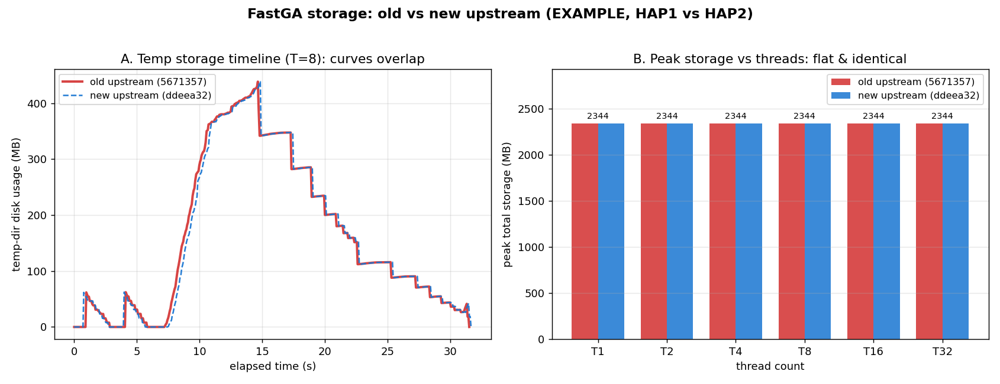

# Storage Benchmark: Old vs New Upstream FastGA

Companion to [`benchmark_thread_scaling_upstream.md`](benchmark_thread_scaling_upstream.md).
This study asks a narrow question: **did upstream FastGA's disk footprint change between
the old baseline and the current upstream tip?** Both versions are pure upstream — neither
carries the `optimize-memory` storage optimizations.

## TL;DR

**No meaningful change.** Old and new upstream produce a byte-identical storage profile on
the EXAMPLE dataset (default, no-mask run). Peak disk is thread-independent for both.

| | commit | peak persistent | peak temp | **peak total** |
|---|---|---:|---:|---:|
| Old upstream | `5671357` "fixed a 11th column bug" | 1905.3 MB | 438.4 MB | **2343.7 MB** |
| New upstream | `ddeea32` "Fixed … ANO_PAIR.parse" (= `main` `10ebff7`) | 1905.3 MB | 438.4 MB | **2343.7 MB** |

## What "old" and "new" mean here

- **Old upstream = `5671357`** — the merge-base of `optimize-memory` and `upstream/main`;
  i.e. the upstream commit the storage-optimization work originally branched from
  (the old `main` was `c1b9197`, a rebase of local commits onto `5671357`).
- **New upstream = `ddeea32`** — current `upstream/main`; local `main` is `10ebff7`
  (= `ddeea32` + one `.gitignore` commit).
- Between them: **11 upstream commits**, almost all ANO/annotation (masking) work,
  plus README bioconda badges, `ALNplot -G`, and a Makefile cleanup.

## Method

Same methodology as [`benchmark_instructions.md`](old_archive/benchmark_instructions.md)
(storage audit v2): FastGA run with `-k` (keep GIX) and `-P <dedicated tmpdir>`, while a
background monitor polls `du -sb` on the tmpdir every 50 ms to capture the
`open()`-then-`unlink()`ed temp files (`_pair.*`, `_uniq.*`, `_algn.*`) that are invisible
to `ls`. Persistent files (GDB `.1gdb`/`.bps`, GIX `.gix`/`.ktab.*`) are measured separately.
Threads swept T = 1, 2, 4, 8, 16, 32. Each version built from a clean `git worktree`.

- Driver: `benchmarks/run_storage_audit_v2.sh` (adapted per-version to point at the
  worktree binary and a fresh output dir)
- Raw data: `benchmarks/storage_audit_old_upstream/`, `benchmarks/storage_audit_main_upstream/`
- Figure: `benchmarks/plot_upstream_storage_comparison.py`

## Results

### Peak storage vs threads (both versions)

| Threads | persistent (MB) | temp (MB) | peak total (MB) |
|---:|---:|---:|---:|
| 1 | 1905.3 | 438.4 | 2343.7 |
| 2 | 1905.3 | 438.4 | 2343.7 |
| 4 | 1905.3 | 438.4 | 2343.7 |
| 8 | 1905.3 | 438.4 | 2343.7 |
| 16 | 1905.3 | 438.4 | 2343.7 |
| 32 | 1905.3 | 438.4 | 2343.7 |

Identical across old and new. The **only** numeric difference in the entire audit is the
raw temp-peak byte count at T=1: old `459,744,630` vs new `459,744,650` — a **20-byte**
(0.000004%) gap, i.e. `du` sampling jitter on the temp-file plateau, not a real change.
All MB-rounded values and all of T=2..32 match to the byte.

### Thread independence

Peak storage is flat from T=1 to T=32 for both versions (Panel B). More threads only
**compress the timeline in wall-clock** (Panel A shape narrows) — the peak magnitude is
set by genome content + parameters (K=40, `-f`), not by parallelism. This matters for
concurrent runs: higher T holds the peak for less time, lowering disk-collision risk, but
does not lower the peak itself.

## Why identical — source-level confirmation

Diffing the storage-relevant sources between `5671357` and `ddeea32`:

| File | changed? | relevance to default-run disk output |
|---|---|---|
| `libfastk.c/.h` | **no** | ktab/post writers — untouched |
| `MSDsort.c`, `RSDsort.c` | **no** | radix sorts / temp writers — untouched |
| `GDB.h` | **no** | — |
| `FastGA.c` | +2/−3 | removed `-S` help line; `@`→`#` in the GIXmake mask-file arg — **only runs when masks are supplied** (NMASK>0); default EXAMPLE run has NMASK=0 |
| `GIXmake.c` | +1/−1 | `int64→int moff` inside `setup_thread_with_masks` — **mask-only path**, in-memory only |
| `GDB.c` | +26/−16 | ANO/mask logic (`moff` type, `masks[].parse=0` init — the ddeea32 bug fix, `ano->maxpar`) and read-path `Uncompress_Read(...,beg)` signature — **read path**, does not change bytes written |

Every change is in the ANO/mask path (inactive without `-M`), an in-memory type, a read-path
decompression signature, or help text. Nothing on the default write path changed → the
`.bps`, `.gix`/`.ktab`/`.post`, and temp files are produced by identical code, hence
byte-identical output. The FastGA *binary* does differ (399,936 vs 400,000 bytes) because
these edits still compile in — but they never execute for the default run.

## Implications

- The storage baseline established on the old upstream is **still valid** for the new
  upstream; no re-baselining needed.
- Any masking (`-M`) workload could in principle differ (ANO code changed substantially) —
  out of scope here; this study is the default no-mask path.
