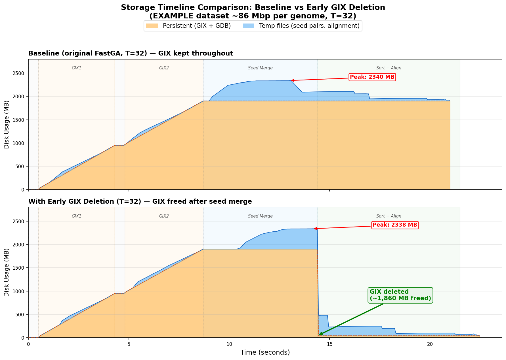

# Optimization 1: Early GIX Deletion

## Summary

Delete GIX files (`.gix` + `.ktab.*`) immediately after seed merge completes, instead of at program exit. The GIX is only needed during the seed merge phase; the sort+align phase (82% of runtime for human genomes) never accesses GIX files.

| Property | Value |
|---|---|
| **Type** | Zero-cost |
| **Quality tier** | Tier 1 (Bit-exact) |
| **Target** | Reduce disk held during sort+align phase |
| **Code changes** | `FastGA.c` only (~35 lines added, 4 removed) |

## Why It Works

The `Kmer_Stream` objects (which read `.ktab.*` files) are already freed at the end of `adaptamer_merge()` (line 2483 in FastGA.c). The `Post_List` objects hold open FDs to `.post.*` files but are not used after seed merge. The sort+align phase (`pair_sort_search()`) only reads:
- `.bps` files (2-bit compressed DNA sequences) for alignment
- `_pair.*` temp files (seed pairs from seed merge)

It never touches `.gix` or `.ktab.*` files.

## Implementation

**File**: `FastGA.c`

**Change 1** — After seed merge returns (~line 5159), free Post_Lists and delete GIX:

```c
//  Free Post_Lists (no longer needed after seed merge)

if ( ! SELF)
  Free_Post_List(P2);
Free_Post_List(P1);

//  Early GIX deletion: GIX files are only needed during seed merge.
//    Delete them now to free disk space for the sort+align phase.
//    Only delete GIX we generated (not user-provided), and only if -k is not set.
//    Use -f (not -fg) to preserve the GDB which is still needed for alignment.

if ( ! KEEP)
  { char *command;
    // ... allocate command string ...
    if (TYPE1 <= IS_GDB)
      { sprintf(command,"GIXrm -f %s/%s.gix",PATH1,ROOT1);
        system(command);
        TYPE1 = IS_GDB + 1;  // prevent Clean_Exit() from double-deleting
      }
    if (TYPE2 <= IS_GDB)
      { sprintf(command,"GIXrm -f %s/%s.gix",PATH2,ROOT2);
        system(command);
        TYPE2 = IS_GDB + 1;
      }
    free(command);
  }
```

Key design decisions:
- **`-f` not `-fg`**: Only delete GIX, preserve GDB (`.1gdb` + `.bps` needed for alignment)
- **`TYPE = IS_GDB + 1`**: Prevents `Clean_Exit()` from trying to delete already-removed files
- **`!KEEP` guard**: Respects `-k` flag — if user wants to keep indices, skip early deletion
- **`TYPE <= IS_GDB` check**: Only delete GIX that FastGA generated, not user-provided `.gix` files
- **SELF mode**: When comparing a genome against itself (P2 == P1), only free P1 once

**Change 2** — Remove old `Free_Post_List` calls at end of `main()` (~line 5283), since they've been moved up.

## Verification

### Bit-exact Output (EXAMPLE dataset, T=8)

Both runs compared via `ONEview` (text dump of `.1aln` file):
- Raw `.1aln` files differ by 6 bytes — only the command-line string in the header (`-k` flag present/absent)
- After skipping the header, `diff` on all alignment records: **zero differences**
- Alignment count, positions, trace points — all identical

### Functional Checks

| Check | With `-k` | Without `-k` |
|---|---|---|
| GIX files after seed merge | Kept (as expected) | **Deleted** |
| GDB files after run | Kept | **Kept** (preserved by `-f` not `-fg`) |
| Alignment output | Identical | Identical |

## Storage Timeline Comparison



**Top panel (baseline)**: GIX stays at ~1,860 MB throughout the sort+align phase. Total disk hovers at ~1,900-2,340 MB for the entire run.

**Bottom panel (early deletion)**: Same peak (~2,338 MB during seed merge), but immediately after seed merge completes, GIX is deleted — storage drops from ~2,338 MB to ~438 MB (seed pair temps only), then drains to near zero as partitions are consumed.

**During sort+align (the longest phase)**: Disk usage drops from ~1,900 MB to ~438 MB — a **77% reduction**.

## Performance Comparison (EXAMPLE dataset, T=32)

| Metric | Baseline (`-k`) | Early GIX Deletion | Diff |
|---|---:|---:|---|
| Wall clock | 15.90s | 15.87s | -0.03s (noise) |
| User CPU | 121.45s | 119.21s | -2.2s (noise) |
| System CPU | 29.46s | 30.15s | +0.7s (noise) |
| Peak RSS | 757,720 KB | 757,836 KB | identical |

Per-phase wall clock:

| Phase | Baseline | Early Deletion |
|---|---:|---:|
| GDB (both) | 0.89s | 0.90s |
| GIX build (both) | 3.15s | 3.14s |
| Seed merge | 4.25s | 4.34s |
| Sort + align | 7.54s | 7.40s |

**Zero performance impact.** The `GIXrm` call only `unlink()`s files, taking negligible time. All differences are within run-to-run variation.

## Impact at Human Genome Scale

| Scenario | During Sort+Align |
|---|---:|
| Baseline | ~64 GB (GIX held) |
| With early deletion | **~7 GB** (seed pair temps only) |
| **Reduction** | **~57 GB freed (89%)** |

For concurrent runs on the same HPC node:

| Scenario | Two concurrent human runs (sort+align overlap) |
|---|---:|
| Baseline | 64 + 64 = **128 GB** |
| With early deletion | 7 + 7 = **14 GB** |

## Git Info

| | Commit | Description |
|---|---|---|
| Docs | `049e311` | Optimization framework + Opt 1 documentation |
| Code | `77ac29d` | `FastGA.c` change + plot script |

To revert this optimization's code change while keeping docs:
```bash
git revert 77ac29d
```

## Checklist

- [x] Code change implemented
- [x] Builds without new warnings
- [x] Output verification: Tier 1 bit-exact (ONEview diff, header-only difference)
- [x] Storage timeline comparison figure generated
- [x] Performance comparison (runtime) measured — zero impact
- [x] Tested on EXAMPLE dataset (T=8 for bit-exact, T=32 for storage/perf)
- [ ] Tested on human genome dataset
- [x] Results documented in this file
- [x] README.md status table updated
