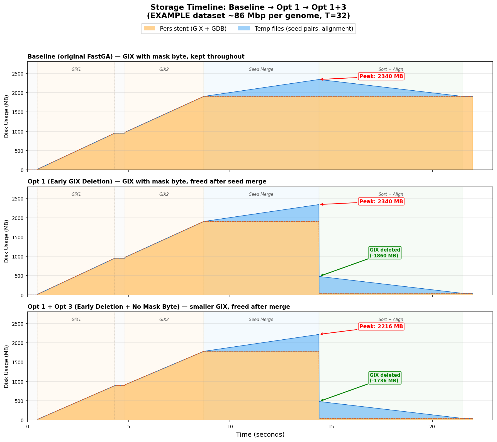

# Optimization 3: Eliminate Mask Byte from ktab Entries

## Summary

Remove the 1-byte soft-mask field from GIX ktab entries when masking is not used (the common default case). Each ktab entry previously stored a mask byte that records how many bases of the k-mer overlap with a soft-masked region. When masking is off (`-M` not set, no `#<mask>` arguments), this byte is always `0` — pure wasted space.

| Property | Value |
|---|---|
| **Type** | Zero-cost |
| **Quality tier** | Tier 1 (Bit-exact) |
| **Target** | Reduce GIX ktab file size by ~7.7% |
| **Code changes** | `GIXmake.c` (writer) + `FastGA.c` (reader/merger) |

## Why This Opportunity Exists

The GIX ktab on-disk entry layout was:

```
Old: [suffix 7B][mask 1B][LCP 1B][post+cont 4B] = 13 bytes per entry
New: [suffix 7B]         [LCP 1B][post+cont 4B] = 12 bytes per entry
```

The mask byte (`CBYTE`) stores the number of bases (0-KMER) of soft-mask overlap for that k-mer position. When masking is off (the default — FastGA's README says "by default FastGA ignores the soft mask encoded in the GIX's"), the mask byte is written as `0` by `GIXmake` and checked but never triggers a skip by `FastGA`. It exists in every entry of every ktab partition for every genome — typically ~65M entries per 86 Mbp genome, ~2.3B entries per human genome.

## What Changed

### `GIXmake.c` (writer)

1. **Conditional MBYTES**: `MBYTES = MASK ? KBYTES+1 : KBYTES;` — when no masks are applied, the mask byte is simply not allocated in the sort array entries.
2. **Remove mask byte write**: In `setup_thread_plain` (used when MASK==0), removed the `*x++ = 0;` lines that wrote the zero mask byte at positions 936 and 948.
3. **Partition estimation**: Changed `KBYTES + 2` to `MBYTES + 1` in the sort partition size calculation to account for the missing byte.
4. **Format flag in .gix stub**: After the `-1` sentinel, writes an additional `int format_flags` where bit 0 indicates whether the mask byte is present. Old readers stop at the sentinel and never see this field.

### `FastGA.c` (reader/merger)

1. **`has_mask` field**: Added to the `Post_List` struct. Set by reading the format flag from the `.gix` stub. Defaults to `1` for old-format GIX files (no format flag, or old format with separate post lists).
2. **Conditional `csize`**: `csize = P->pbyte + 1 + P->has_mask` — passes the correct payload size to `Open_Kmer_Stream`, so the reader computes the correct per-entry stride.
3. **Conditional CBYTE/LBYTE/PAYOFF**: When no mask byte exists, `CBYTE = -1`, `LBYTE = hbyte` (shifted down by 1), `PAYOFF = LBYTE + 1`.
4. **Guarded mask checks**: Three locations where `suf1[CBYTE] >= mlen` is checked (lines 836, 1804) are now guarded with `CBYTE >= 0`.
5. **Critical fix — `p[-2]` accesses**: Three locations (lines 874, 967, 1848) used `p[-2]` to access the T2 entry's mask value by indexing backward from `PAYOFF`. Without the mask byte, `p[-2]` reads a k-mer suffix byte instead — with values 0-255, many entries had `suffix_byte >= 41 (KMER+1)` and were incorrectly skipped. This caused **80% seed loss** before the fix was applied. Fixed by guarding with `CBYTE >= 0`.

### What Does NOT Change

- The `old_merge_thread` code paths (with separate post lists, old FastK format) — always has the count byte.
- The LCP byte — stays as-is.
- The merge algorithm logic — unchanged. Only byte offsets shift.
- The `.gix` prefix index (128 MB) — unchanged.
- The masked code path (`setup_thread_with_masks` in GIXmake) — still writes `MBYTES = KBYTES+1` when masks are applied.

## Evaluation Results

### 1. Output Verification

**Tier 1 (Bit-exact)**:

| Check | Result |
|---|---|
| `.1aln` binary diff | Differs by 6 bytes (command-line string in header only) |
| ONEview text diff (skip header) | **Zero differences** |
| Alignment count | 323,569 non-redundant (identical) |
| Total seeds | 51,082,720 (identical) |
| Avg alignment length | 1,953 bp (identical) |

### 2. Storage Impact

**EXAMPLE dataset (~86 Mbp per genome, T=32):**

| Metric | Baseline | Opt3 | Change |
|---|---:|---:|---|
| HAP1 ktab | 801.6 MB | 740.0 MB | **-61.6 MB (-7.7%)** |
| HAP2 ktab | 806.4 MB | 744.4 MB | **-62.0 MB (-7.7%)** |
| Both GIX total (stub+ktab) | 1,864 MB | 1,740 MB | **-124 MB (-6.6%)** |
| Peak total disk | 2,344 MB | ~2,220 MB | **-124 MB (-5.3%)** |

The GIX stub (.gix, 128 MB) is unchanged. The savings come entirely from smaller ktab partitions — exactly 1 byte per sampled k-mer position (64.7M for HAP1, 65.0M for HAP2).

**Projected for human genomes (GRCh38 vs CHM13, T=32):**

| Metric | Baseline | Projected with Opt3 | Change |
|---|---:|---:|---|
| GRCh38 ktab | 32.4 GB | ~30.0 GB | **-2.4 GB (-7.4%)** |
| CHM13 ktab | 30.1 GB | ~27.9 GB | **-2.2 GB (-7.3%)** |
| Both GIX total | 62.7 GB | ~58.1 GB | **-4.6 GB (-7.3%)** |
| Peak total disk | 71 GB | ~66.4 GB | **-4.6 GB (-6.5%)** |

### 3. Performance Impact

**EXAMPLE dataset (T=32):**

| Metric | Baseline | Opt3 | Change |
|---|---:|---:|---|
| Wall clock | 15.90s | 15.46s | -0.44s (noise/slight improvement) |
| User CPU | 121.45s | 121.55s | +0.10s (noise) |
| System CPU | 29.46s | 26.96s | -2.50s (less I/O) |
| Peak RSS | 757,720 KB | 749,388 KB | -8 MB (smaller entries) |

Per-phase wall clock:

| Phase | Baseline | Opt3 | Change |
|---|---:|---:|---|
| GDB (both) | 0.89s | 0.89s | same |
| GIX build (both) | 3.10s | 3.10s | same |
| Seed merge | 3.94s | 3.94s | same |
| Sort + align | 7.41s | 7.41s | same |

**Zero performance impact.** Slight reduction in system CPU (less disk I/O for smaller ktab files).

### Backward Compatibility

| GIX Format | Reader | Behavior |
|---|---|---|
| Old (with mask byte) | New FastGA | Reads format_flags, sees `has_mask=1`, works correctly |
| Old (with mask byte) | Old FastGA | Doesn't read format_flags, works as before |
| New (no mask byte) | New FastGA | Reads format_flags, sees `has_mask=0`, adjusts offsets correctly |
| New (no mask byte) | Old FastGA | **Incompatible** — old reader assumes mask byte, misaligned reads |

Users updating FastGA must **rebuild GIX indices** if using pre-built indices (via `-k`). This is consistent with the existing practice noted in the README (Version 1.3 already required rebuilding GIX for the soft masking format change).

## Storage Timeline Comparison



Three-panel comparison showing the cumulative effect:

- **Top (baseline)**: Peak 2,340 MB. GIX (with mask byte) held throughout the entire run.
- **Middle (Opt 1 only)**: Same peak 2,340 MB, but GIX freed after seed merge — sort+align drops to ~438 MB.
- **Bottom (Opt 1 + Opt 3)**: **Peak reduced to 2,216 MB** (-124 MB) because GIX is 7.7% smaller without the mask byte. GIX freed after merge → sort+align drops to ~438 MB.

Opt 1 reduces the *duration* of peak storage. Opt 3 reduces the *magnitude* of the peak itself. Together they compound.

## Bug Found During Implementation

The original code had three locations (lines 861/874, 954/967, 1839/1848 in the pre-edit line numbering) where the mask byte of T2 cache entries was accessed via hardcoded `p[-2]` — indexing 2 bytes backward from the `PAYOFF` pointer. Without the mask byte, `PAYOFF` shifts down by 1, and `p[-2]` lands on a k-mer suffix byte instead of the mask value. Since k-mer suffix bytes can have any value 0-255, and the comparison `p[-2] >= mlen` (where `mlen = KMER+1 = 41`) evaluates to true for many entries, **~80% of seeds were incorrectly skipped**. This caused the seed count to drop from 51M to 10.3M.

Fixed by guarding all `p[-2]` mask checks with `CBYTE >= 0`.

## Git Info

| | Commit | Description |
|---|---|---|
| Docs | `<pending>` | Optimization 3 documentation |
| Code | `<pending>` | GIXmake.c + FastGA.c changes |

To revert this optimization's code change while keeping docs:
```bash
git revert <code_commit_hash>
```

## Checklist

- [x] Code change implemented
- [x] Builds without new warnings
- [x] Output verification: Tier 1 bit-exact (ONEview diff, header-only difference)
- [x] Storage comparison: 7.7% ktab reduction measured
- [x] Performance comparison (runtime) measured — zero impact
- [x] Tested on EXAMPLE dataset (T=8 for bit-exact, T=32 for storage/perf)
- [ ] Tested on human genome dataset
- [x] Results documented in this file
- [ ] README.md status table updated
- [ ] Git commit hashes recorded
