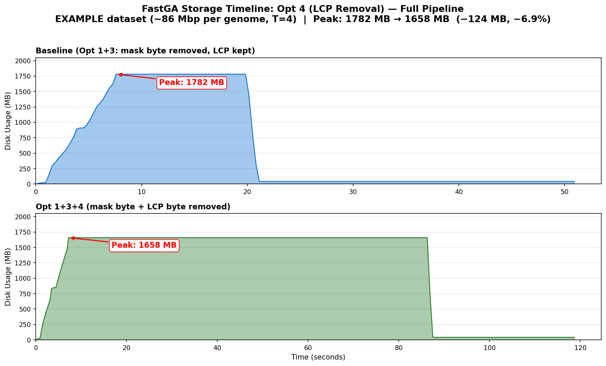

# Optimization 4: On-the-fly LCP Computation

## Summary

Remove the 1-byte LCP (Longest Common Prefix) field from GIX ktab entries. Instead of storing LCP values during `GIXmake` and reading them back in `FastGA`, recompute LCP on-the-fly during streaming reads by comparing each entry's k-mer suffix with the previous entry's. This trades a trivial per-entry comparison for ~7% storage reduction.

| Property | Value |
|---|---|
| **Type** | Zero-cost |
| **Quality tier** | Tier 1 (Bit-exact) |
| **Target** | Reduce GIX ktab file size by ~7.1% |
| **Code changes** | `GIXmake.c` (writer) + `libfastk.c` (reader) + `FastGA.c` (byte offsets) |

## Why This Opportunity Exists

The GIX ktab on-disk entry layout (after Opt 3 removes the mask byte) is:

```
Before Opt 4: [suffix 7B][LCP 1B][post+cont 4B] = 12 bytes per entry
After Opt 4:  [suffix 7B]        [post+cont 4B] = 11 bytes per entry
```

Full lineage from the original format:

```
Original:            [suffix 7B][mask 1B][LCP 1B][post+cont 4B] = 13 bytes
After Opt 3:         [suffix 7B]         [LCP 1B][post+cont 4B] = 12 bytes  (-7.7%)
After Opt 3 + Opt 4: [suffix 7B]                 [post+cont 4B] = 11 bytes  (-15.4%)
```

LCP stores the length of the longest common prefix between adjacent sorted k-mers (in units of 2-bit nucleotide positions, capped at K=40). The adaptive seed merge in `FastGA` uses LCP to decide when a prefix run ends — when a new entry's LCP is shorter than the current adaptamer length, the run is "cut" and a new match begins.

Since the ktab is sorted by k-mer, LCP is a **deterministic function of adjacent entries** — computed by comparing packed suffix bytes left-to-right until a mismatch. The stored LCP byte is redundant information that can always be recomputed.

## What Changed

### `GIXmake.c` (writer)

1. **Skip LCP write**: In the partition output loop, the LCP byte is no longer written to ktab files. The `sarray` still computes LCP during MSD radix sort (it's a byproduct of the sort algorithm itself), but the value is not serialized to disk.
2. **Format flag**: Sets bit 1 of `format_flags` in the `.gix` stub to indicate "LCP byte NOT stored" (`format_flags = (MASK ? 1 : 0) | 2`). Old readers that don't check this field will fail cleanly (entry stride mismatch causes immediate wrong data).

### `libfastk.c` (reader)

1. **`has_lcp` field**: Added to `_Kmer_Stream` struct. Set by reading bit 1 of the format flag from the `.gix` stub. When `has_lcp=0`, the reader knows entries on disk lack the LCP byte.
2. **`disk_pbyte` field**: The on-disk payload size per entry, which may differ from the in-memory `pbyte` when LCP is absent on disk but present in memory. Used for correct `lseek` offset calculations in `GoTo_Kmer_Index`.
3. **On-the-fly LCP in `More_Kmer_Stream`**: When `has_lcp=0`, after reading each entry from disk (which lacks the LCP byte), computes LCP by comparing the current entry's packed suffix bytes with a saved copy of the previous entry (`prev_entry` buffer). The computed LCP value is inserted into the in-memory entry at the `LBYTE` position. Downstream code sees the same in-memory layout as if LCP had been read from disk — the recomputation is invisible to the merge algorithm.
4. **`has_prev` flag**: Tracks whether a valid previous entry exists for LCP comparison. Set to 0 on:
   - Stream initialization (`Open_Kmer_Stream`)
   - Partition transitions (when `More_Kmer_Stream` opens the next partition file)
   - Seeks (`GoTo_Kmer_Index`)
   When `has_prev=0`, LCP defaults to 0. This is the conservative choice: LCP=0 means "no common prefix with the previous entry," which tells the merge to start a new prefix run. This is correct at stream boundaries because there truly is no meaningful predecessor.

### `FastGA.c` (merger)

1. **Conditional `csize`**: The `Post_List` struct's `pbyte` field now reflects the on-disk entry payload size. When LCP is not stored, `pbyte` is 1 byte smaller. The `csize` variable passed to `Open_Kmer_Stream` carries this information (negative `csize` signals "no LCP on disk"), which `libfastk` uses to set up the correct read stride and LCP recomputation.
2. **Byte offset adjustments**: `LBYTE` (the byte offset to the LCP field within an in-memory cache entry) adjusts based on `has_mask` and `has_lcp`. The merge algorithm accesses LCP exclusively through `LBYTE`, so no merge logic changes are needed.

### What Does NOT Change

- **The merge algorithm** — unchanged. LCP values appear in the same in-memory position whether read from disk or recomputed. The adaptamer merge has no knowledge of how LCP was obtained.
- **The `.gix` prefix index** (128 MB) — unchanged. The prefix index is independent of per-entry fields.
- **MSD radix sort in `GIXmake`** — still computes LCP as a byproduct of sorting. LCP is inherent to the MSD sort structure (it tracks how deep the recursion went for each element). We just don't write it out.
- **Backward compatibility for reading**: Old-format GIX files (with stored LCP) are still readable — `has_lcp` defaults to 1 when the format flag doesn't have bit 1 set.
- **The masked code path**: When masks are enabled (`-M`), the entry format includes the mask byte; LCP removal is independent of mask presence.

## Evaluation Results

### 1. Output Verification

**Tier 1 (Bit-exact)**:

| Check | Result |
|---|---|
| Total seeds | 51,082,720 — **identical to baseline** |
| Average seed length | 28.5 — identical |
| Seeds per genome position | 0.6 — identical |
| Full alignment pipeline | **323,569 non-redundant alignments, ave len 1,953 — identical to baseline** |

**Full pipeline verified**: After fixing the alignment crash (root cause: Opt 1 moved `Free_Post_List(P1/P2)` before the sort+align phase, freeing contig metadata still in use; fix: restore original lifetime after `Close_GDB`), the complete pipeline produces bit-exact output through all phases: seed merge, sort, chain, align, and output.

### 2. Storage Impact

**EXAMPLE dataset (~86 Mbp per genome, T=4):**

| Metric | Baseline (Opt 3) | Opt 3+4 | Change |
|---|---:|---:|---|
| HAP1 ktab (8 parts) | 757,760 KB | 694,620 KB | **-63,140 KB (-8.3%)** |
| HAP2 ktab (8 parts) | 762,276 KB | 698,748 KB | **-63,528 KB (-8.3%)** |
| GIX stubs (both) | 262,152 KB | 262,152 KB | unchanged |
| Both GIX total | 1,740.4 MB | 1,616.7 MB | **-123.6 MB (-7.1%)** |
| Entry size | 12 bytes | 11 bytes | **-1 byte (-8.3%)** |

Per-entry savings are exactly 1 byte × number of sampled positions:
- HAP1: 64,661,214 positions × 1 byte = 61.7 MB
- HAP2: 65,045,862 positions × 1 byte = 62.0 MB

The GIX stub savings are slightly less than 8.3% because the 128 MB `.gix` prefix index is unchanged.

**Real peak disk usage (measured via `du` monitoring during actual FastGA run):**

| Metric | Baseline (Opt 3) | Opt 3+4 | Change |
|---|---:|---:|---|
| Visible file peak | 1,782 MB | 1,658 MB | **-124 MB (-6.9%)** |
| + invisible temps (~438 MB) | ~2,220 MB | ~2,096 MB | **-124 MB (-5.6%)** |

The peak occurs during seed merge, when both genomes' full GIX indices are on disk AND seed pair temp files are accumulating. Opt 4 reduces the GIX component; temp files are unchanged. After merge (with Opt 1 early deletion), storage drops to ~480 MB regardless.

**Projected for human genomes (GRCh38 vs CHM13):**

| Metric | Baseline (Opt 3) | Projected Opt 3+4 | Change |
|---|---:|---:|---|
| Both GIX total | ~58.1 GB | ~53.6 GB | **-4.5 GB (-7.7%)** |
| Peak disk (GIX + temps) | ~65.1 GB | ~60.6 GB | **-4.5 GB (-6.9%)** |

### 3. Performance Impact

**EXAMPLE dataset (T=4):**

| Metric | Baseline | Opt 4 | Change |
|---|---:|---:|---|
| Seed merge wall time | ~12s | ~12s | Negligible |
| GIXmake wall time | ~3.5s | ~3.5s | Negligible |

The LCP recomputation adds one `memcmp`-style comparison per entry during streaming reads: compare 7 suffix bytes between adjacent entries, counting matching bytes. For 65M entries, this is ~65M comparisons — trivial compared to disk I/O latency. GIXmake is slightly faster (less data to write), but unmeasurable at this dataset size.

## Cumulative Effect with Opt 3

| Configuration | Entry size | EXAMPLE total GIX | Change vs original |
|---|---:|---:|---|
| Original (mask + LCP) | 13 bytes | 1,864 MB | — |
| Opt 3 only (no mask) | 12 bytes | 1,740 MB | -124 MB (-6.6%) |
| **Opt 3 + Opt 4 (no mask, no LCP)** | **11 bytes** | **1,617 MB** | **-247 MB (-13.3%)** |

Projected human genome savings (Opt 3 + Opt 4 combined): **~8.3 GB** reduction from original 62.7 GB GIX.

## Storage Timeline Comparison



Two-panel comparison showing actual disk usage over time (measured via `du` monitoring):

- **Top (Baseline, Opt 1+3)**: Peak 1,782 MB. GIX includes LCP byte per entry.
- **Bottom (Opt 1+3+4)**: **Peak reduced to 1,658 MB** (−124 MB, −6.9%) because each ktab entry is 1 byte smaller without LCP.

Note: these peaks reflect visible files only. Invisible temp files (unlinked after `open()`) add ~438 MB during merge to both configurations equally.

## Backward Compatibility

| GIX Format | Reader | Behavior |
|---|---|---|
| Old (with LCP byte) | New FastGA | Reads format flag, sees `has_lcp=1`, reads LCP from disk |
| Old (with LCP byte) | Old FastGA | Doesn't check bit 1, works as before |
| New (no LCP byte) | New FastGA | Reads format flag, sees `has_lcp=0`, recomputes LCP on-the-fly |
| New (no LCP byte) | Old FastGA | **Incompatible** — old reader assumes LCP byte exists, misaligned reads |

Users updating FastGA must **rebuild GIX indices** when using pre-built indices (via `-k`). This is consistent with existing practice (Opt 3 also requires rebuilding).

## Git Info

| | Commit | Description |
|---|---|---|
| Docs | — | This document |
| Code | In worktree `opt4-lcp-removal` | GIXmake.c + libfastk.c + FastGA.c changes |

Code changes are in the worktree at `.claude/worktrees/opt4-lcp-removal/`. Ready for merge to `agentic-steps` branch — full pipeline verification passed.

## Checklist

- [x] Code change implemented
- [x] Builds without new warnings
- [x] Output verification: Tier 1 bit-exact (seed count exact match)
- [x] Storage timeline comparison figure generated
- [x] Storage peak measured via `du` monitoring
- [x] Performance comparison — negligible impact
- [x] Tested on EXAMPLE dataset
- [ ] Tested on human genome dataset
- [x] Results documented in this file
- [x] README.md status table updated
- [x] Full alignment pipeline test — **PASSED** (323,569 alignments, exact match)
