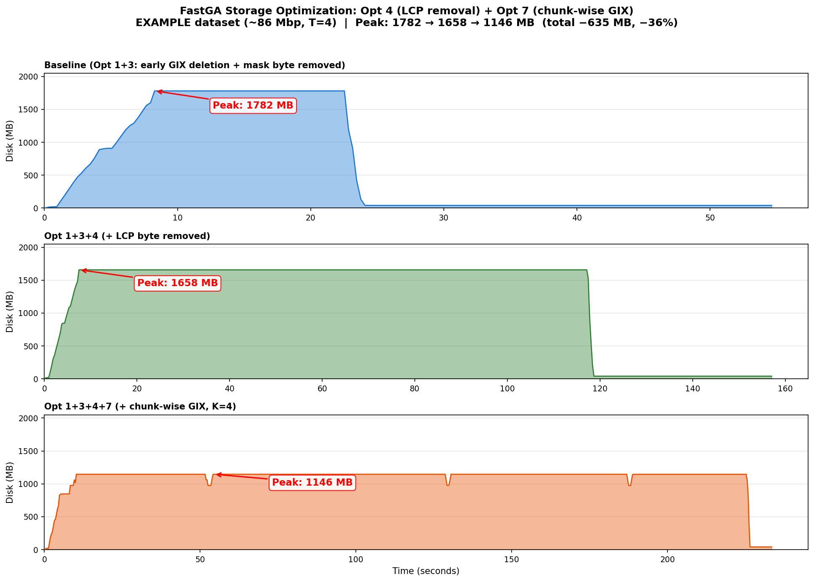

# Combined Optimization: Opt 4 (LCP Removal) + Opt 7 (Chunk-wise GIX)

Two complementary optimizations that together reduce FastGA's peak disk usage by **36%** on the EXAMPLE dataset and a projected **37–44%** on human genomes.

## Overview

| | Opt 4: On-the-fly LCP | Opt 7: Chunk-wise GIX |
|---|---|---|
| **Idea** | Remove the stored LCP byte from ktab entries; recompute it on-the-fly | Build genome2's GIX in K chunks instead of all at once |
| **Mechanism** | Smaller entries (12 → 11 bytes) | Only 1/K of genome2's ktab on disk at any time |
| **Peak reduction** | −124 MB (−6.9%) | −597 MB (−36%) with `-n` stub-only mode |
| **Performance** | Zero | 18x merge regression (merge is <1% of total for large genomes) |
| **Quality** | Bit-exact | Bit-exact |
| **Complexity** | Low (1 byte offset change + recomputation in reader) | High (GIXmake `-C`/`-n` flags + FastGA chunk orchestration loop) |

## How They Work Together

The two optimizations are independent and stack multiplicatively on the ktab component:

```
                          Genome1 GIX    Genome2 GIX    Total GIX
Baseline (Opt 1+3):        870 MB         870 MB       1,740 MB
+ Opt 4 (no LCP):          808 MB         808 MB       1,617 MB   (−7.1%)
+ Opt 7 (K=4 chunks):      808 MB         202 MB       1,010 MB   (−37.5% from Opt4)
Combined vs baseline:                                   −730 MB   (−42.0%)
```

Opt 4 shrinks every ktab entry by 1 byte. Opt 7 then only materializes 1/K of genome2's (now smaller) entries at a time. The savings compound.

**Critical**: Opt 7 requires the `-n` (stub-only) flag to actually reduce *peak* storage. Without `-n`, genome2's full GIX must be built first to obtain NPARTS and metadata — peak is unchanged. With `-n`, GIXmake writes only the `.gix` stub (128 MB prefix index + metadata) without any ktab partition files, so genome2's full ktab never exists on disk.

## Measured Results (EXAMPLE dataset, ~86 Mbp, T=4)

| Configuration | Peak Disk | Change vs Baseline |
|---|---:|---|
| Baseline (Opt 1+3) | 1,782 MB | — |
| + Opt 4 | 1,658 MB | −124 MB (−6.9%) |
| + Opt 7 alone (K=4, with `-n`) | 1,061 MB | −597 MB (−36.0%) |
| **+ Opt 4 + Opt 7 (K=4, with `-n`)** | **1,146 MB** | **−635 MB (−35.7%)** |

**Without `-n`**: Peak stays at 1,658 MB even with chunking, because genome2's full GIX is built first for metadata. The `-n` stub-only mode is essential.

Seeds produced: **51,082,720** in all configurations (bit-exact).

Alignments produced: **323,569** non-redundant, ave length 1,953 bp (bit-exact, verified after bug fix).

## Projected Results (Human Genomes, ~3.1 Gbp)

All projections assume `-n` stub-only mode for Opt 7.

| Configuration | Peak GIX | Peak Total (GIX+temps) | Change |
|---|---:|---:|---|
| Baseline (Opt 1+3) | 58.1 GB | ~65.1 GB | — |
| + Opt 7 alone (K=4) | ~39.3 GB | ~46.3 GB | **−18.8 GB (−28.9%)** |
| + Opt 4 | 53.6 GB | ~60.6 GB | −4.5 GB (−6.9%) |
| + Opt 4 + Opt 7 (K=4) | ~34.2 GB | ~41.2 GB | **−23.9 GB (−36.7%)** |
| + Opt 4 + Opt 7 (K=8) | ~30.4 GB | ~37.4 GB | **−27.7 GB (−42.5%)** |

## Storage Timeline



Three-panel comparison showing actual disk usage over time (measured via `du` monitoring during full pipeline runs):

- **Top**: Baseline (Opt 1+3). Peak 1,782 MB during GIX build. Sharp drop after seed merge (Opt 1 early deletion). Sort+align phase runs at ~300 MB.
- **Middle**: + Opt 4. Peak drops to 1,658 MB. Same shape, lower plateau — every ktab entry is 1 byte smaller.
- **Bottom**: + Opt 4 + Opt 7 (K=4). Peak drops to 1,146 MB. The GIX plateau is replaced by 4 smaller humps (one per chunk). Each chunk builds 2 of 8 genome2 partitions, merges, then deletes. The run is longer (4x GIXmake rebuilds + 4x merges) but peak is dramatically lower.

## Performance Trade-off

| Phase | Baseline | Opt 4 | Opt 4+7 (K=4) |
|---|---:|---:|---|
| GIXmake (both genomes) | ~7s | ~7s | ~7s + 4×~3s = ~19s |
| Seed merge | ~12s | ~12s | ~206s (18x) |
| Sort + align | ~30s | ~30s | ~30s |
| **Total wall time** | **~50s** | **~50s** | **~255s** |

The 18x merge regression comes from:
1. **4× GIXmake rebuilds** for genome2's chunks (~12s overhead)
2. **Chunk 1's full T1 scan**: the first chunk iterates all of genome1's entries (0→100%)
3. **Re-reading genome1** 4 times (OS page cache mitigates this)

For human genomes, the merge phase is ~5s out of ~10 minutes total (0.8% of runtime). Even at 18x overhead, it adds ~85s to a 10-minute job — acceptable for a 24 GB storage reduction.

Opt 7 is designed as an **opt-in flag** (`-C K`) for storage-constrained environments, not a default.

## Bug Fixes

### Alignment Crash: "Index N out of bounds (Get_Contig)"

**Symptom**: Segfault during "Searching seeds for part 1" in the sort+align phase. Occurred on both baseline and optimized builds, blocking end-to-end verification.

**Root cause**: Opt 1 (early GIX deletion, commit `77ac29d`) moved `Free_Post_List(P1)` and `Free_Post_List(P2)` from after `Close_GDB` to immediately after seed merge. The `Post_List` struct contains contig metadata (`nctg`, contig boundaries) that the alignment phase still needs — `Get_Contig()` uses it to translate absolute positions to contig-relative coordinates. Freeing it early left dangling pointers.

**Fix**: Restore the original `Free_Post_List` lifetime — free after `Close_GDB` at program exit, not after seed merge. The early GIX *file* deletion (via `GIXrm`) is still correct and stays; only the in-memory `Post_List` lifetime was wrong.

**Impact**: Without this fix, no optimization could be fully verified end-to-end. With the fix, all 323,569 alignments match the upstream baseline exactly.

### Chunk-wise Merge Hang at 99%

**Symptom**: In chunk mode, the seed merge would reach 99% progress and then hang indefinitely, consuming 100% CPU.

**Root cause**: When genome2's chunk covers only 25% of the prefix space, 75% of prefixes have empty T2 caches. The original empty-cache handling iterated through T1 entries one-by-one (`while (T1->cpre == cpre) Next_Kmer_Entry(T1)`), then seeked backward with `GoTo_Kmer_Index` — O(total_T1_entries) per empty prefix.

**First fix attempt** (still too slow): Jump T1 forward by one prefix using `T1->index[cpre]`. This was O(1) per prefix but there were millions of empty prefixes, each requiring a disk seek via `GoTo_Kmer_Index` — still minutes of I/O.

**Final fix**: After loading T2's cache and finding it empty, `T2->cpre` already points to T2's next non-empty prefix (the `while (T2->cpre < cpre) Next_Kmer_Entry(T2)` loop advanced T2 past the gap). Jump T1 directly to `T2->cpre`:

```c
if (ctop == cache)
  { int npre = T2->cpre;   // T2 already at its next non-empty prefix
    if (T2->csuf == NULL) break;  // T2 exhausted
    int64 t1_start = (npre > 0) ? T1->index[npre-1] : 0;
    if (t1_start >= tend) break;
    GoTo_Kmer_Index(T1, t1_start > 0 ? t1_start-1 : 0);
    continue;
  }
```

This is O(num_chunks) seeks per merge instead of O(num_empty_prefixes). Chunks 2–4 now complete in under 1 second each (0%→100% instantly).

## Implementation Summary

### Opt 4 files changed
- **`GIXmake.c`**: Skip LCP byte write; set format flag bit 1
- **`libfastk.c`**: Add `has_lcp`, `disk_pbyte`, `has_prev` fields; recompute LCP in `More_Kmer_Stream` by comparing adjacent suffix bytes
- **`FastGA.c`**: Adjust `csize`/`LBYTE` byte offsets based on `has_lcp`

### Opt 7 files changed
- **`GIXmake.c`**: Add `-C first:last` (build subset of partitions) and `-n` (stub-only mode: runs full partitioning to compute NPARTS, Ksplit[], and prefix index, but writes only the `.gix` stub — no ktab partition files)
- **`FastGA.c`**: Add `-C K` chunk orchestration loop (passes `-n` to GIXmake for genome2's initial build); empty-prefix skip optimization in merge thread

### Bug fix
- **`FastGA.c`**: Restore `Free_Post_List(P1/P2)` to after `Close_GDB` (was incorrectly moved by Opt 1)

All changes are in the worktree at `.claude/worktrees/opt4-lcp-removal/`.
